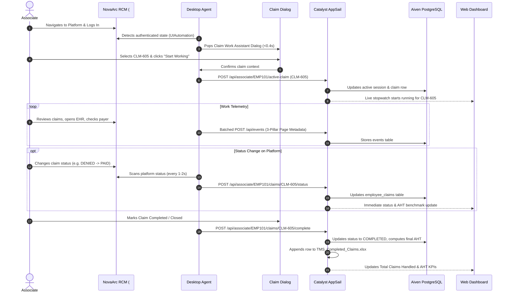

# Data Flow & Lifecycle

```mermaid
sequenceDiagram
    autonumber
    actor Associate
    participant Platform as NovaArc RCM (#/claims)
    participant Agent as Desktop Agent
    participant Modal as Claim Dialog
    participant Backend as Catalyst AppSail
    participant DB as Aiven PostgreSQL
    participant Dashboard as Web Dashboard

    Associate->>Platform: Navigates to Platform & Logs In
    Agent->>Platform: Detects authenticated state (UIAutomation)
    Agent->>Modal: Pops Claim Work Assistant Dialog (<0.4s)
    Associate->>Modal: Selects CLM-605 & clicks "Start Working"
    Modal->>Agent: Confirms claim context
    Agent->>Backend: POST /api/associate/EMP101/active-claim (CLM-605)
    Backend->>DB: Updates active session & claim row
    Backend-->>Dashboard: Live stopwatch starts running for CLM-605
    
    loop Work Telemetry
        Associate->>Platform: Reviews claims, opens EHR, checks payer
        Agent->>Backend: Batched POST /api/events (3-Pillar Page Metadata)
        Backend->>DB: Stores events table
    end

    opt Status Change on Platform
        Associate->>Platform: Changes claim status (e.g. DENIED -> PAID)
        Agent->>Platform: Scans platform status (every 1-2s)
        Agent->>Backend: POST /api/associate/EMP101/claims/CLM-605/status
        Backend->>DB: Updates employee_claims table
        Backend-->>Dashboard: Immediate status & AHT benchmark update
    end

    Associate->>Modal: Marks Claim Completed / Closed
    Agent->>Backend: POST /api/associate/EMP101/claims/CLM-605/complete
    Backend->>DB: Updates status to COMPLETED, computes final AHT
    Backend->>Backend: Appends row to TMS_Completed_Claims.xlsx
    Backend-->>Dashboard: Updates Total Claims Handled & AHT KPIs
```
