# TMS — MVP Architecture & Workflow
### AI-Powered Transaction Intelligence Platform

---

## 1. System Architecture — Big Picture

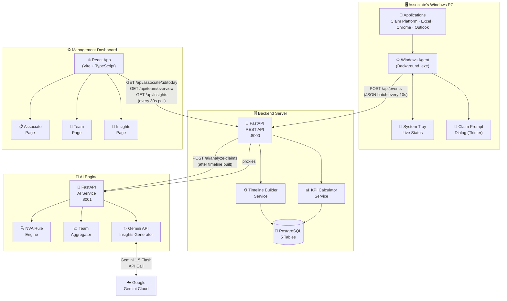

---

## 2. Technology Stack

| Layer | Technology | Why |
|---|---|---|
| **Windows Agent** | Python 3.11, `psutil`, `pygetwindow`, `pynput`, `tkinter`, `pystray` | Native Windows APIs, lightweight, packagable as .exe |
| **Backend API** | FastAPI + `uvicorn` (async) | High-throughput async event ingestion, auto Swagger docs |
| **Database** | PostgreSQL 15 | Relational integrity, time-series queries, JSON support |
| **ORM** | SQLAlchemy 2.0 (async) + Alembic | Type-safe queries, schema migrations |
| **AI Engine** | FastAPI + `google-generativeai` | Microservice isolation, Gemini 1.5 Flash for insights |
| **NVA Rules** | Pure Python (no ML) | Deterministic, fast, no training data needed for MVP |
| **Dashboard** | React 18 + Vite + TypeScript | Fast HMR dev, type-safe, production-ready bundle |
| **Charts** | Recharts | React-native, composable, works with our data shape |
| **Packaging** | Docker Compose (backend + AI + DB) | One-command local setup |
| **Agent Packaging** | PyInstaller | Single .exe, no Python runtime needed on agent PC |

---

## 3. Data Flow — Event to Dashboard

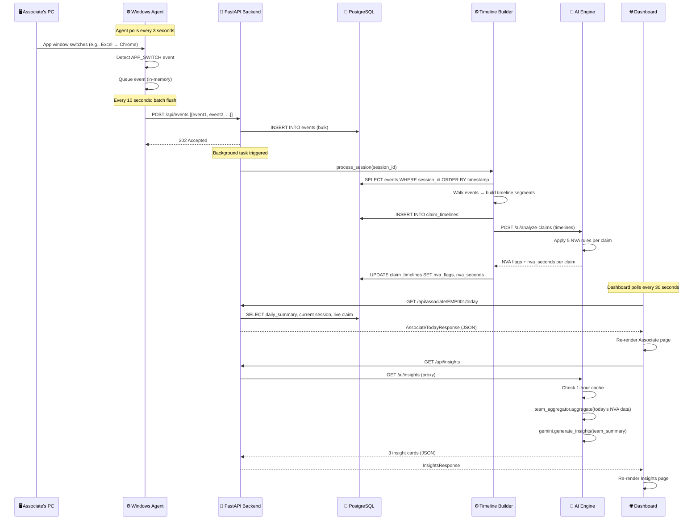

---

## 4. Windows Agent — Internal Architecture

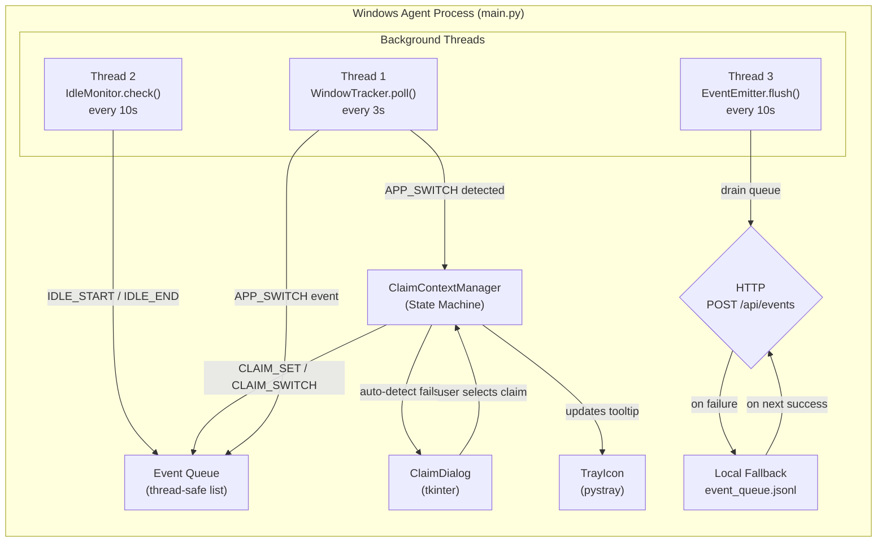

### Agent State Machine

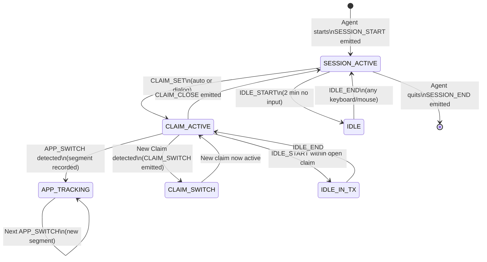

---

## 5. Claim Detection Workflow

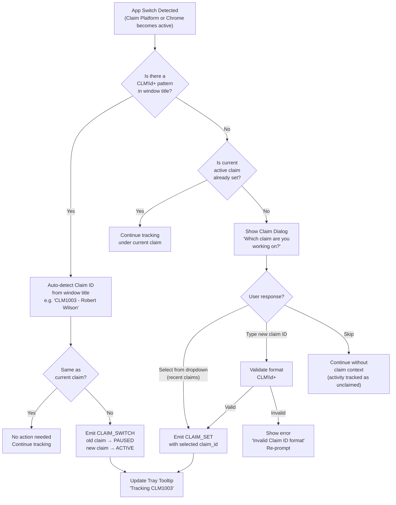

---

## 6. Backend — Request Flow

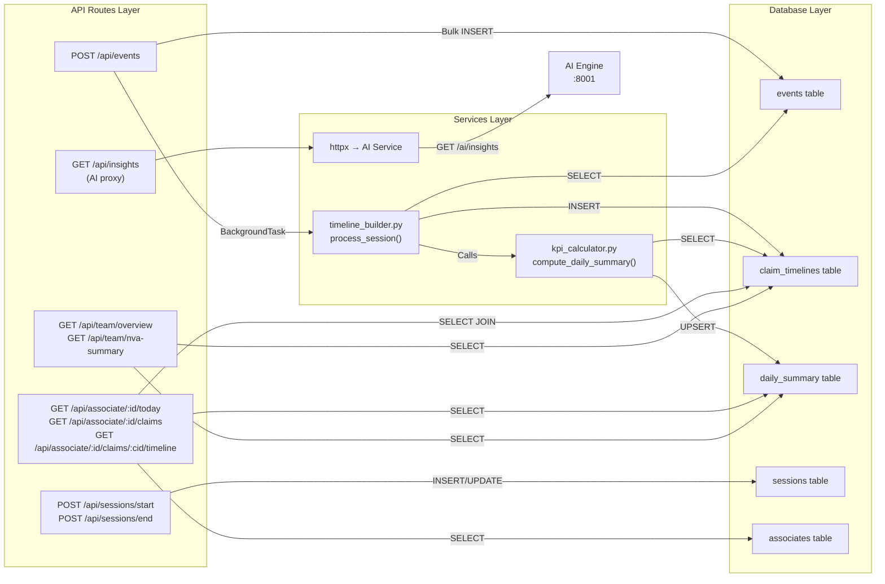

---

## 7. Database Schema — Entity Relationship

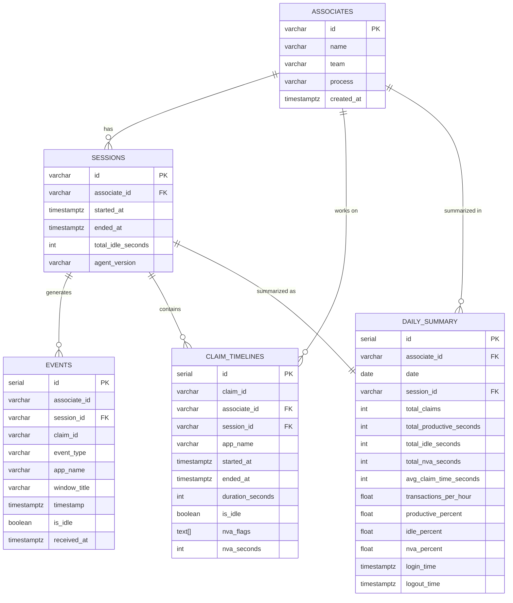

---

## 8. Timeline Builder — Core Algorithm

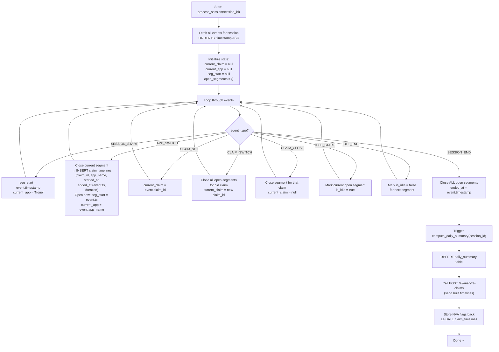

---

## 9. AI Engine — NVA Detection Flow

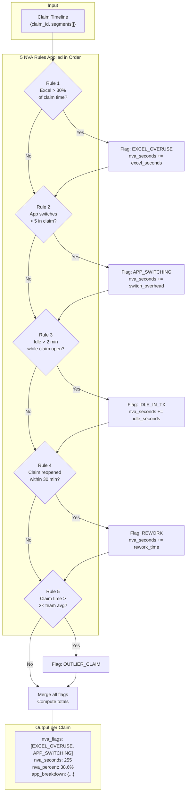

---

## 10. Gemini Insights — Generation Flow

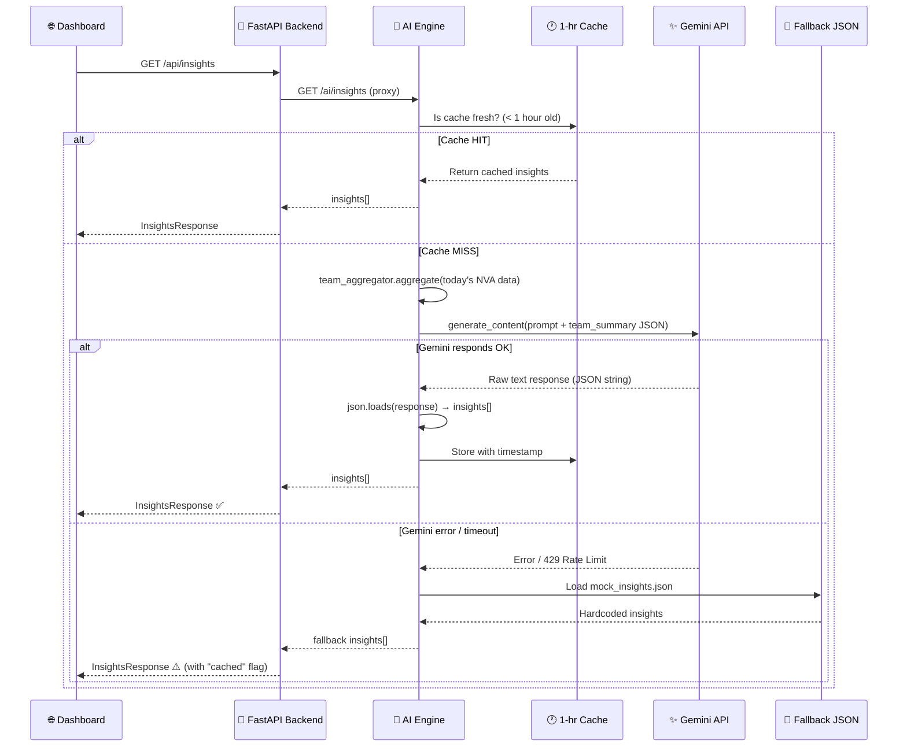

---

## 11. Dashboard — Component & Data Flow

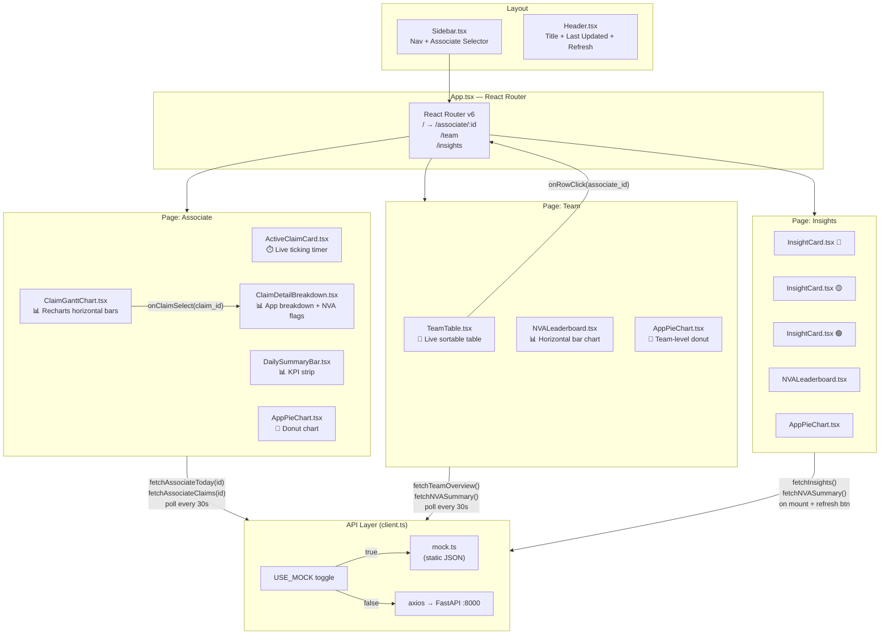

---

## 12. Deployment Topology

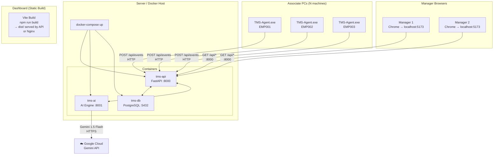

---

## 13. End-to-End Workflow — Single Claim Lifecycle

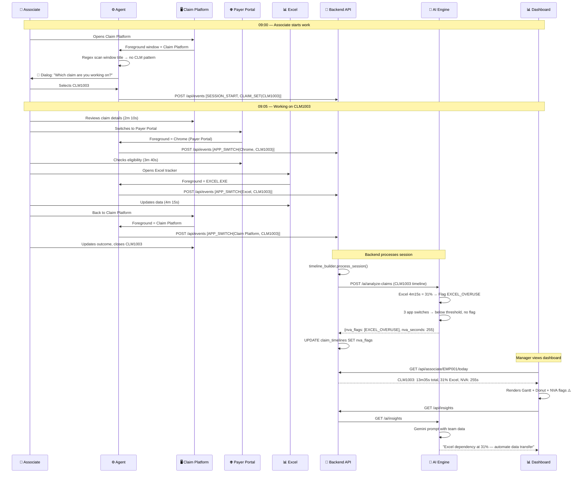

---

## 14. Error Handling & Resilience

```mermaid
flowchart TD
    subgraph AGENT_ERR["Agent Error Handling"]
        A1["Backend unreachable"] --> A2["Queue to event_queue.jsonl\n(local disk)"]
        A2 --> A3["Retry on next\nsuccessful connection"]

        B1["Dialog skipped by user"] --> B2["Activity tracked\nunder claim_id = null\n(orphan events)"]

        C1["Auto-detect fails"] --> C2["Show dialog\n(fallback)"]
    end

    subgraph BACKEND_ERR["Backend Error Handling"]
        D1["Duplicate events received"] --> D2["INSERT ON CONFLICT\nDO NOTHING\n(idempotent)"]

        E1["AI Engine down"] --> E2["Timeline built without\nNVA flags\nnva_flags = []"]
        E2 --> E3["NVA analysis runs\nwhen AI recovers\n(retroactive update)"]

        F1["Malformed event JSON"] --> F2["Log + discard\n(400 Bad Request)"]
    end

    subgraph AI_ERR["AI Engine Error Handling"]
        G1["Gemini API error\nor 429 rate limit"] --> G2["Return fallback\nmock_insights.json"]
        G2 --> G3["Add 'cached' flag\nin response"]

        H1["Team NVA data empty\n(no timelines yet)"] --> H2["Return empty insights\nwith message:\n'Not enough data yet today'"]
    end

    subgraph DASH_ERR["Dashboard Error Handling"]
        I1["API unreachable\n(fetch fails)"] --> I2["Show last cached data\n+ 'Data may be stale' banner"]
        I2 --> I3["Retry on next\n30-second poll"]

        J1["USE_MOCK = true"] --> J2["Always uses\nstatic mock.ts data\n(never fails)"]
    end
```

---

## 15. MVP — What's In, What's Out

| Feature | ✅ In MVP | Reason |
|---|---|---|
| App switch tracking | ✅ | Core requirement |
| Idle time detection | ✅ | Core KPI |
| Claim prompt dialog | ✅ | Primary claim detection |
| Window title regex (CLM\d+) | ✅ | Simple auto-detect |
| Session start/end | ✅ | Core requirement |
| Claim timeline builder | ✅ | Core requirement |
| 5 NVA rules (rule-based) | ✅ | No ML needed |
| KPI calculator (all 7 KPIs) | ✅ | Core requirement |
| Gemini AI insights (3 cards) | ✅ | Key differentiator |
| Associate dashboard | ✅ | Core dashboard |
| Team overview | ✅ | Core dashboard |
| Insights page | ✅ | Key differentiator |
| 30-second polling | ✅ | Sufficient for MVP |
| Local event fallback queue | ✅ | Resilience |
| System tray icon | ✅ | UX essential |
| DOM/URL browser claim detection | ❌ Skip | Complex, post-MVP |
| UI Automation / OCR | ❌ Skip | Complex, post-MVP |
| WebSocket real-time | ❌ Skip | Polling sufficient |
| Before vs. After comparison | ❌ Skip | Needs baseline history |
| Automation opportunity scorer | ❌ Skip | Post-MVP |
| Admin panel | ❌ Skip | Post-MVP |
| Multi-client/process hierarchy | ❌ Skip | Post-MVP |
