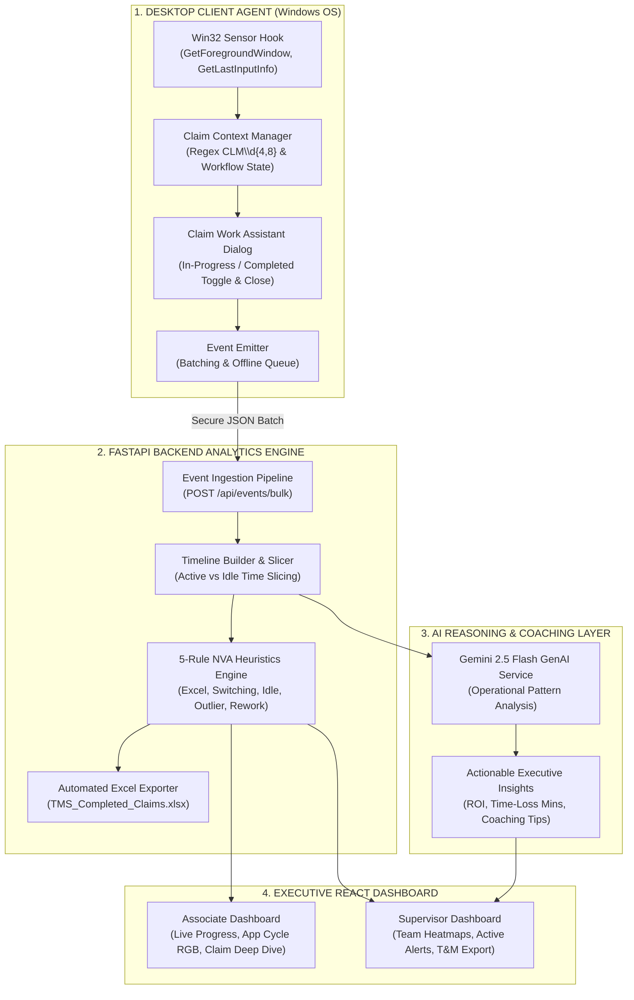
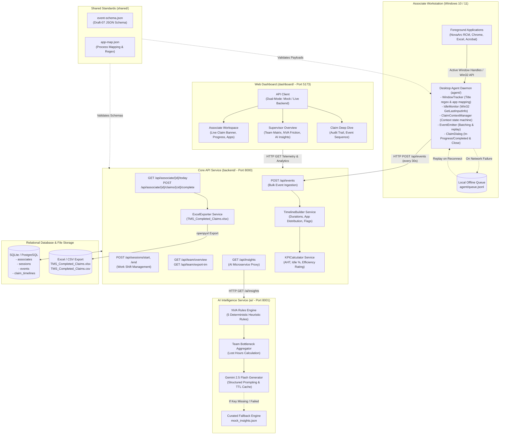

# Transaction Management System (TMS)

**AI-Powered Telemetry and Effort Intelligence for Revenue Cycle Management**  
*Enterprise MVP Foundation for Accounts Receivable (AR) Operations*

 *

## 1\. Executive Summary

In healthcare Revenue Cycle Management (RCM), Accounts Receivable associates spend their working shifts processing medical claims across disparate systems:

*   Primary Billing Platforms (e.g., NovaArc RCM, ClaimPlatform, Epic, Cerner)
*   Payer Portals (e.g., Availity, UnitedHealthcare, Medicare portals in Chrome/Edge)
*   Offline Worksheets (Microsoft Excel spreadsheets for fee schedules and modifier lookup)
*   Communication and Documentation Tools (Outlook, Teams, Adobe Acrobat)

### The Core Operational Problem

Operations managers currently lack granular visibility into how long claims take to resolve. Manual time logs are inaccurate, and simple window tracking fails because an associate actively switches between 3 to 5 applications to work on a single claim.

### The TMS Solution: Active Claim Context Tracking

TMS introduces **Active Claim Context Tracking**:

1. When an associate opens a claim in their billing software, the lightweight desktop agent detects the claim identifier (CLM\d+) from the window title.
2. The agent activates that claim’s context (e.g., Active Claim = CLM1003).
3. Every subsequent window visit (Excel, Chrome, Acrobat) is automatically attributed to CLM1003 until another claim is opened or the current claim is completed.
4. The backend reassembles these telemetry events into clean claim timelines with application time distributions.
5. The AI rules engine and Google Gemini identify Non-Value-Added (NVA) friction points—such as excessive spreadsheet lookups, rapid context toggling, and extended idle gaps—delivering actionable coaching insights to team supervisors.

 *

## 2\. Core Solution Blueprint: The “Why”, “How”, and “Where”

### System Architecture Overview Diagram



#### How the 4 Layers Work Together

1. Layer 1: Desktop Client Agent (The Sensory Nervous System on Windows)Runs silently in the background of each associate’s PC with < 1% CPU utilization.Win32 Sensor Hook (W32): Continuously detects which window is active (GetForegroundWindow) and whether the user is idle (GetLastInputInfo) without recording keystrokes or screens (100% HIPAA compliant).Claim Context Manager (CCM): Detects claim IDs like CLM-001 using regular expressions (CLM\d{4,8}) and locks cross-app activity (Excel lookups, Chrome payer portals) to that active claim.Claim Work Assistant Dialog (DLG): Provides the interactive floating assistant where associates select claims, toggle between IN_PROGRESS and COMPLETED, and click Close to complete a claim and remove it from the dropdown.Event Emitter (EMIT): Batches heartbeat telemetry every 30 seconds (or on claim close) and maintains a local offline queue (queue.jsonl) so no data is ever lost if network drops.
2. Layer 2: FastAPI Backend Analytics Engine (The Central Processing Hub)Event Ingestion Pipeline (INGEST): Receives secured JSON telemetry batches from desktop agents.Timeline Builder & Slicer (TLB): Glues thousands of raw window switches into a unified chronological claim journey, slicing active vs. idle duration and app breakdown.5-Rule NVA Heuristics Engine (NVA): Evaluates Lean healthcare friction rules (Excel Overuse >40%, Context Thrashing ≥8 switches, Long Idle ≥180s, Duration Outliers ≥20m, and Duplicate Touches/Rework).Automated Excel Exporter (XLS): Automatically formats and appends completed claims into [TMS_Completed_Claims.xlsx](file:///b:/Projects/TMS/TMS_Completed_Claims.xlsx) (matching the standard 15-column Prev Entd Voice T&M.xlsx layout).
3. Layer 3: AI Reasoning & Coaching Layer (The Cognitive Intelligence Brain)Gemini 2.5 Flash GenAI Service (GEMINI): Evaluates aggregate operational patterns across the entire shift.Actionable Executive Insights (INSIGHTS): Converts abstract time data into concrete business metrics: calculates total lost hours, estimates dollar cost impact, identifies root causes, and delivers step-by-step coaching playbooks for team supervisors.
4. Layer 4: Executive React Dashboard (The Real-Time Command Center)Associate Dashboard (ASSOC_DASH): Displays real-time progress toward shift targets (e.g. 1 / 40 claims), vibrant RGB application time share cycles (isolated per claim), and reverse-chronological event audit streams.Supervisor Dashboard (SUP_DASH): Gives team leads a live cockpit showing team AHT, associate active/idle statuses, real-time friction alert banners, and 1-click downloads of official Voice Time & Motion logs.

 *

### A. WHY? — Purpose, Core Problems & Architectural Decisions

#### 1\. The Business Need: Why Traditional Time & Motion Fails

*   **The Pain of Manual Studies**: Traditional healthcare operations rely on manual stopwatches, observer shadowing, and self-reported Excel sheets (such as `Prev Entd Voice T&M.xlsx`). This introduces severe observer bias, distorts real associate handling times, and wastes over 15–20% of an associate’s shift just filling out activity logs.
*   **Cross-Application Fragmentation**: Revenue cycle associates never stay inside a single application. Resolving a single claim (`CLM-001`) requires toggling between billing platforms (NovaArc / Athena), payer portals (UHC, Medicare, Availity in Chrome), fee schedule workbooks in Excel, and communication channels. Traditional window trackers treat each switch as disconnected noise rather than one unified claim journey.

#### 2\. The Architectural Choice: Why Use an AI Agent When Win32 API is Already Used?

A common executive question is: *“If low-level Win32 API hooks already monitor windows, why do we need an AI Agent?”*

> **The Sensory vs. Cognitive Distinction:**  
> **Win32 is the Sensory Nervous System (Eyes & Ears); the AI Agent is the Cognitive Brain (Intelligence & Decision Making).**

| Functional Capability | Win32 API Alone (Low-Level OS Hooks) | AI Agent & Intelligence Layer (The Cognitive Brain) |
| :--- | :--- | :--- |
| **Observation Scope** | Blind, low-level OS primitives: window handles (`HWND`), pixel coordinates, mouse idle ticks (`GetLastInputInfo`). | **Healthcare Domain Understanding**: Identifies medical claims (`CLM\d{4,8}`), patient contexts, denial workflows, and payer portals. |
| **Context Synthesis** | Emits thousands of raw, disconnected window title strings with zero correlation. | **Context State Machine**: Binds multi-app transitions across Chrome, Excel, and EHR to the current active claim. |
| **Operational Friction Analysis** | Cannot distinguish between productive work, confusion, or bottlenecked waiting. | **5 Deterministic Lean Heuristics**: Automatically flags Excel Overuse (>40%), Context Thrashing (≥8 switches), Long Idle Gaps (≥180s), Outliers (≥20m), and Rework. |
| **Executive Intelligence & ROI** | Zero business intelligence; produces no recommendations. | **Generative AI Coaching (Gemini 2.5 Flash)**: Translates raw shift seconds into financial ROI, operational lost hours, and personalized coaching plans for supervisors. |

#### 3\. Privacy by Design: Why Zero-PHI / Zero-PBI?

*   **100% HIPAA Compliant**: The agent monitors **only process names and window headers**. It **never records keystrokes**, captures screenshots, or reads clipboard buffers, ensuring patient health information (PHI) never leaves the local machine.

 *

### B. HOW? — Implementation Mechanics & End-to-End Workflow

#### 1\. Foreground Capture & Context Locking

*   `WindowTracker` registers lightweight Win32 hooks to intercept foreground window transitions with `< 1%` CPU utilization.
*   `ClaimContextManager` applies regex matching (`CLM\d{4,8}`) to isolate active claim IDs and dynamically locks cross-application activity (Excel lookups, Chrome portal checks) to that claim.

#### 2\. Interactive Claim Work Assistant (Desktop & Dashboard)

*   **Automatic Activation**: Triggers automatically when an associate signs into NovaArc RCM or switches to other applications.
*   **Inline Status Toggle (`IN_PROGRESS` ↔ `COMPLETED`)**: In the dropdown, existing claims are listed with interactive status badges. Associates can toggle between active processing (`IN_PROGRESS`, amber `#b45309`) and completion (`COMPLETED`, emerald `#15803d`).
*   **One-Click `Close` Action**: Clicking the `Close` button beside any claim:
    
    1. Immediately vanishes the claim from the active dropdown list so the associate has a clean view for their next claim.
    2. Updates the claim status to COMPLETED across the database and live dashboard.
    3. Automatically updates and exports the collected claim data into [TMS_Completed_Claims.xlsx](file:///b:/Projects/TMS/TMS_Completed_Claims.xlsx) (and companion .csv) matching the exact 15-column schema of Prev Entd Voice T&M.xlsx.
    4. Retains all historical metrics, time distributions, and NVA tags in the dashboard’s audit log.
    

#### 3\. Intelligent Time Slicing & Heuristic Friction Detection

*   The FastAPI backend reassembles raw heartbeat events into clean `ClaimTimeline` entries.
*   Sequential timestamps are sliced into active versus idle seconds.
*   The 5-Rule NVA Engine flags operational bottlenecks in real time:
    *   **Rule 1 (EXCEL\_OVERUSE)**: Excel active time ≥ 40% of duration (min 180s).
    *   **Rule 2 (APP\_SWITCHING)**: Context toggles ≥ 8 switches per claim.
    *   **Rule 3 (LONG\_IDLE)**: Continuous or accumulated idle time ≥ 180s.
    *   **Rule 4 (OUTLIER)**: Claim duration ≥ 1200s (20 mins).
    *   **Rule 5 (REWORK)**: Same claim handled across multiple distinct sessions/touches.

#### 4\. Automated Time & Motion Excel Generation

*   When a claim is closed, `services.excel_exporter` uses `openpyxl` to append or update standard Time & Motion taxonomy steps (Login, Pre-service analysis, EOB review, Insurance call, Notes documentation, etc.) with precise durations, categories (VA, BVA, NVA), and IST timestamps.

#### 5\. Generative AI Coaching (Gemini 2.5 Flash)

*   The AI service analyzes team-level aggregated friction patterns.
*   It calculates total lost hours, estimates dollar impact, and outputs structured insight cards containing specific root-cause analysis and actionable coaching recommendations for supervisors.

 *

### C. WHERE? — System Boundaries, Architecture Locations & File Manifest

| Architectural Layer | Physical Location | Runtime Environment & Port | Key Responsibilities & Primary Source Files |
| :--- | :--- | :--- | :--- |
| **Desktop Telemetry Daemon** | \[`agent/`\](file:///b:/Projects/TMS/agent) | Windows 10/11 Client Daemon | Win32 hooks, idle tracking, floating Claim Work Assistant dialog.  <br>\- \[`tracker.py`\](file:///b:/Projects/TMS/agent/tracker.py), \[`idle_monitor.py`\](file:///b:/Projects/TMS/agent/idle\_monitor.py)  <br>\- \[`dialog.py`\](file:///b:/Projects/TMS/agent/dialog.py), \[`main.py`\](file:///b:/Projects/TMS/agent/main.py) |
| **Core API & Analytics Engine** | \[`backend/`\](file:///b:/Projects/TMS/backend) | Python / FastAPI  <br>`http://localhost:8000` | Bulk event ingestion, time-slicing timeline builder, KPI calculation, automated Excel export.  <br>\- \[`routes/associate.py`\](file:///b:/Projects/TMS/backend/routes/associate.py), \[`services/timeline_builder.py`\](file:///b:/Projects/TMS/backend/services/timeline\_builder.py)  <br>\- \[`services/excel_exporter.py`\](file:///b:/Projects/TMS/backend/services/excel\_exporter.py), \[`models.py`\](file:///b:/Projects/TMS/backend/models.py) |
| **AI Intelligence Service** | \[`ai/`\](file:///b:/Projects/TMS/ai) | Python / FastAPI  <br>`http://localhost:8001` | 5 Lean NVA rules engine, team bottleneck aggregation, Gemini 2.5 Flash GenAI coaching.  <br>\- \[`nva_engine.py`\](file:///b:/Projects/TMS/ai/nva\_engine.py), \[`gemini_insights.py`\](file:///b:/Projects/TMS/ai/gemini\_insights.py) |
| **Executive Web Dashboard** | \[`dashboard/`\](file:///b:/Projects/TMS/dashboard) | React 18 + Vite + TS  <br>`http://localhost:5173` | Associate shift workspace, vibrant RGB time cycles, supervisor team overview, claim audit trail.  <br>\- \[`pages/AssociateDashboard.tsx`\](file:///b:/Projects/TMS/dashboard/src/pages/AssociateDashboard.tsx)  <br>\- \[`components/ClaimWorkAssistantModal.tsx`\](file:///b:/Projects/TMS/dashboard/src/components/ClaimWorkAssistantModal.tsx) |
| **Persistence & Export Storage** | Root & \[`backend/`\](file:///b:/Projects/TMS/backend) | Local SQLite / PostgreSQL | Database storage (`tms.db`) and Time & Motion exports:  <br>\- \[`TMS_Completed_Claims.xlsx`\](file:///b:/Projects/TMS/TMS\_Completed\_Claims.xlsx)  <br>\- \[`TMS_Completed_Claims.csv`\](file:///b:/Projects/TMS/TMS\_Completed\_Claims.csv) |
| **Shared Contracts** | \[`shared/`\](file:///b:/Projects/TMS/shared) | Contract Repository | Single Source of Truth for JSON Schemas and application mapping dictionaries.  <br>\- \[`event-schema.json`\](file:///b:/Projects/TMS/shared/event-schema.json), \[`app-map.json`\](file:///b:/Projects/TMS/shared/app-map.json) |

 *

## 3\. Full System Architecture

### High-Level System Architecture Diagram



 *

## 4\. End-to-End Operational Workflow

The following sequence illustrates a typical claim processing lifecycle from foreground capture to supervisor intelligence and automated Excel export:

```mermaid
sequenceDiagram
    autonumber
    actor Associate as Associate
    participant Agent as Desktop Agent (Member 1)
    participant Backend as FastAPI Backend (Member 2)
    participant DB as SQLite / PostgreSQL (Member 2)
    participant AI as AI Engine (Member 3)
    participant Dashboard as Web Dashboard (Member 4)

    Associate->>Agent: Signs into NovaArc RCM / Opens Claim CLM-001
    Agent->>Agent: ClaimDialog activates; associate confirms CLM-001
    Agent->>Backend: POST /api/associate/EMP101/active-claim (status: IN_PROGRESS)
    
    Associate->>Agent: Switches to Excel for fee schedules, then Chrome portal
    Agent->>Agent: Captures APP_SWITCH; attributes cross-app time to CLM-001

    Note over Associate,Agent: Claim Finished — Associate Closes Claim
    Associate->>Agent: Clicks IN_PROGRESS -> toggles to COMPLETED -> Clicks "Close"
    Agent->>Agent: Destroys row immediately from dropdown
    Agent->>Backend: POST /api/associate/EMP101/claims/CLM-001/complete
    Backend->>DB: Updates status=COMPLETED, writes end_time, saves duration
    Backend->>Backend: Appends claim steps to TMS_Completed_Claims.xlsx

    Note over Backend,AI: Asynchronous Analytics & AI Recommendation Engine
    Backend->>AI: GET /ai/insights (Requests team analysis)
    AI->>AI: NVA Engine flags EXCEL_OVERUSE (>40%) and APP_SWITCHING (>=8)
    AI->>AI: Gemini 2.5 Flash analyzes bottleneck and formulates coaching
    AI-->>Backend: Returns structured JSON insight cards

    Note over Backend,Dashboard: Real-Time Operational Visibility
    Dashboard->>Backend: GET /api/associate/EMP101/today
    Backend-->>Dashboard: Returns Associate KPIs (Completed: 1, AHT: 7.4m)
    Dashboard->>Backend: GET /api/team/overview
    Backend-->>Dashboard: Returns Team Matrix, Alert Banners, and AI Recommendations
```

 *

## 5\. Module Ownership and Documentation

The repository is organized into four decoupled modules and a shared contracts directory. Each folder contains its own dedicated **`README.md`** detailing its specific architecture, component map, and implementation tasks:

| Module Directory | Team Owner | Dedicated Documentation | Primary Technical Responsibilities |
| :--- | :--- | :--- | :--- |
| **`shared/`** | **All Members** | \[Shared Contracts Guide\](file:///b:/Projects/TMS/shared/README.md) | Single Source of Truth for event JSON Schema, process mapping dictionary, and claim regular expressions. |
| **`agent/`** | **Member 1** | \[Desktop Agent Guide\](file:///b:/Projects/TMS/agent/README.md) | Windows daemon, Win32 API hooks, idle detection, active claim state machine, Claim Work Assistant dialog, and tray icon. |
| **`backend/`** | **Member 2** | \[Backend API Guide\](file:///b:/Projects/TMS/backend/README.md) | FastAPI service, async SQLAlchemy ORM models, bulk ingestion, timeline builder, KPI calculator, and automated Excel export. |
| **`ai/`** | **Member 3** | \[AI Engine Guide\](file:///b:/Projects/TMS/ai/README.md) | 5 NVA rules engine, team aggregator, Gemini 2.5 Flash prompt engine, in-memory caching, and microservice endpoints. |
| **`dashboard/`** | **Member 4** | \[Dashboard Guide\](file:///b:/Projects/TMS/dashboard/README.md) | React 18 + Vite + TypeScript SaaS frontend, 2D Sharp UI design system, dual-mode API client, and analytics views. |

 *

## 6\. Repository Structure

```graphql
TMS/
├── shared/                         # Data standards and schemas
│   ├── event-schema.json           # JSON Schema specification for agent events
│   ├── app-map.json                # Executable process name to canonical app mapping
│   └── README.md                   # Shared standards guide
│
├── agent/                          # Member 1: Desktop Agent
│   ├── tracker.py                  # Foreground window tracker and regex extractor
│   ├── idle_monitor.py             # Win32 GetLastInputInfo user inactivity monitor
│   ├── claim_context.py            # Active claim context attribution state machine
│   ├── dialog.py                   # Tkinter Claim Work Assistant (Interactive Status & Close)
│   ├── emitter.py                  # Event batcher with offline disk queue (.jsonl)
│   ├── tray.py                     # Windows notification area system tray icon
│   ├── mock_backend.py             # Standalone HTTP test server
│   ├── config.json                 # Agent intervals and thresholds
│   ├── main.py                     # Agent daemon entrypoint
│   └── README.md                   # Member 1 architecture and implementation guide
│
├── backend/                        # Member 2: Core API and Database
│   ├── database.py                 # Async SQLAlchemy engine (SQLite / PostgreSQL)
│   ├── models.py                   # 5 ORM models (Associate, Session, Event, Timeline, Summary)
│   ├── schemas.py                  # Pydantic validation schemas
│   ├── routes/                     # FastAPI route controllers
│   │   ├── events.py               # POST /api/events (Bulk ingestion)
│   │   ├── sessions.py             # POST /api/sessions/start, /end
│   │   ├── associate.py            # GET /today, POST /complete, POST /status
│   │   ├── team.py                 # GET /api/team/overview, /export-tm
│   │   └── ai_proxy.py             # GET /api/insights (AI microservice proxy)
│   ├── services/                   # Core business logic
│   │   ├── timeline_builder.py     # Duration calculation and event aggregation
│   │   ├── kpi_calculator.py       # AHT, idle ratio, and efficiency score calculation
│   │   └── excel_exporter.py       # Automated openpyxl Prev Entd Voice T&M Excel exporter
│   ├── mock_responses/             # Static mock JSON payloads for frontend development
│   ├── main.py                     # FastAPI application entrypoint
│   └── README.md                   # Member 2 architecture and implementation guide
│
├── ai/                             # Member 3: AI Intelligence Engine
│   ├── nva_engine.py               # 5 Non-Value-Added operational friction rules
│   ├── team_aggregator.py          # Team bottleneck and lost hours calculator
│   ├── gemini_insights.py          # Gemini 2.5 Flash prompt engine with TTL cache
│   ├── sample_timelines.json       # 30 realistic test claims for offline tuning
│   ├── mock_insights.json          # Curated fallback recommendation cards
│   ├── main.py                     # FastAPI microservice entrypoint (Port 8001)
│   └── README.md                   # Member 3 architecture and implementation guide
│
├── dashboard/                      # Member 4: SaaS Web Frontend
│   ├── src/
│   │   ├── api/                    # API communication layer (client.ts, types.ts, mock.ts)
│   │   ├── components/             # UI Components (ClaimWorkAssistantModal, KpiCard, etc.)
│   │   ├── pages/                  # AssociateDashboard, SupervisorDashboard, ClaimDeepDive
│   │   ├── config.ts               # Configuration tokens and color palette
│   │   ├── index.css               # 2D Sharp SaaS design system
│   │   └── App.tsx                 # View state container and routing
│   ├── package.json                # React 18, Vite, Lucide icons
│   └── README.md                   # Member 4 architecture and implementation guide
│
├── TMS_Completed_Claims.xlsx       # Live Excel Time & Motion export matching standard schema
├── TMS_Completed_Claims.csv        # Live CSV companion export
├── verify_core.py                  # Automated multi-subsystem integrity verification script
├── requirements.txt                # Unified repository dependencies (includes openpyxl)
└── README.md                       # Master project architecture guide
```

 *

## 7\. Quickstart: Running the Platform

### Step 1: Install Dependencies

Install all Python dependencies across the core backend, AI microservice, and desktop agent directly from the repository root:

```bash
pip install -r requirements.txt
```

Install frontend dependencies:

```bash
cd dashboard
npm install
cd ..
```

### Step 2: Run the Verification Suite

Run the centralized verification test suite to confirm all schemas, data contracts, and rule engines are fully operational:

```bash
python verify_core.py
```

Expected output: `SUCCESS: ALL TMS CORE MODULES VERIFIED AND OPERATIONAL!`

### Step 3: Start the Subsystems (In 4 Separate Terminals)

#### Terminal 1 — Backend Core API (Port 8000)

```bash
cd backend
python -m uvicorn main:app --host 127.0.0.1 --port 8000 --reload
```

*   Interactive Swagger API Documentation: `http://localhost:8000/docs`
*   Health check: `http://localhost:8000/health`
Note*: Automatically provisions `tms.db` and baseline associate `EMP101`.

#### Terminal 2 — AI Intelligence Microservice (Port 8001)

```bash
cd ai
python -m uvicorn main:app --host 127.0.0.1 --port 8001 --reload
```

*   AI service endpoints: `http://localhost:8001/ai/insights`

#### Terminal 3 — Web Dashboard (Port 5173)

```bash
cd dashboard
npm run dev
```

*   Open your browser at: `http://localhost:5173`
*   **Associate Workspace**: Real-time telemetry, claim KPI progress, and isolated Application Time Share cycle.
*   **Supervisor Overview**: Team performance matrix, NVA friction summary, and Gemini operational insights.
*   **Claim Deep Dive**: Audit stream with reverse-chronological event sequencing (latest timestamp on top).

#### Terminal 4 — Desktop Telemetry Agent

```bash
cd agent
python main.py
```

*   Runs the background telemetry agent on Windows.
*   Monitors foreground window transitions and attributes activity to the active claim.
*   The Claim Work Assistant modal activates upon NovaArc platform sign-in and application switching.

 *

## 8\. Key Operational & UX Capabilities

1. Interactive Claim Status Toggling & Automated Excel Export:In the Claim Work Assistant dropdown (both Desktop Tkinter and Web Modal), existing claims display an interactive badge toggling between IN_PROGRESS (amber) and COMPLETED (emerald).Clicking Close immediately vanishes the claim from the dropdown, marks it COMPLETED on the backend and live dashboard, and updates [TMS_Completed_Claims.xlsx](file:///b:/Projects/TMS/TMS_Completed_Claims.xlsx) with standard 15-column Voice Time & Motion rows.The completed claim remains visible in the dashboard’s audit history with all collected duration and application metrics.
2. Reverse Chronological Event Audit Trail (Claim Deep Dive):In the Claim Deep Dive view, all captured telemetry events are rendered with the latest timestamp at the top (newest first). Supervisors and associates can inspect the most recent interactions instantly without scrolling to the bottom.
3. Vibrant RGB Application Time Share Cycle:The analytical donut chart uses curated, high-saturation, distinct RGB colors for each application and browser (strictly non-grey).Known enterprise applications (NovaArc RCM, ClaimPlatform, Chrome, Edge, Excel, TMS Dashboard, etc.) feature custom brand hues, while dynamic web pages receive deterministic high-contrast RGB colors.
4. Claim-Isolated Time Share (Starts Empty for Every New Claim):The application time share cycle strictly reflects the time spent on the currently active claim.Whenever an associate enters or switches to a new claim ID, the donut cycle starts completely empty (0 time), ensuring prior claims’ metrics are not mixed into the new claim context.
5. Collaborator & Multi-Developer Readiness:Unified root [requirements.txt](file:///b:/Projects/TMS/requirements.txt) eliminates missing dependency errors on fresh checkouts.Dynamic sys.path directory resolution in backend/main.py and ai/main.py supports running commands from either repository root or module subfolders.Automatic database table creation and baseline associate provisioning on fresh git clone setups.

 *

## 9\. Engineering Standards and Team Guidelines

1. Schema Adherence: Any modification to event structures must be updated in [shared/event-schema.json](file:///b:/Projects/TMS/shared/event-schema.json) before updating agent or backend models.
2. Offline Resilience: The desktop agent must never lose data during network disconnections. Events buffer to queue.jsonl and drain sequentially upon reconnection.
3. Decoupled Development: The dashboard contains full mock data fixtures ([dashboard/src/api/mock.ts](file:///b:/Projects/TMS/dashboard/src/api/mock.ts)) allowing UI development without requiring local backend or database services to be running.
4. Code Quality: All Python code includes type hints and docstrings. TypeScript interfaces remain synchronized with backend Pydantic models.