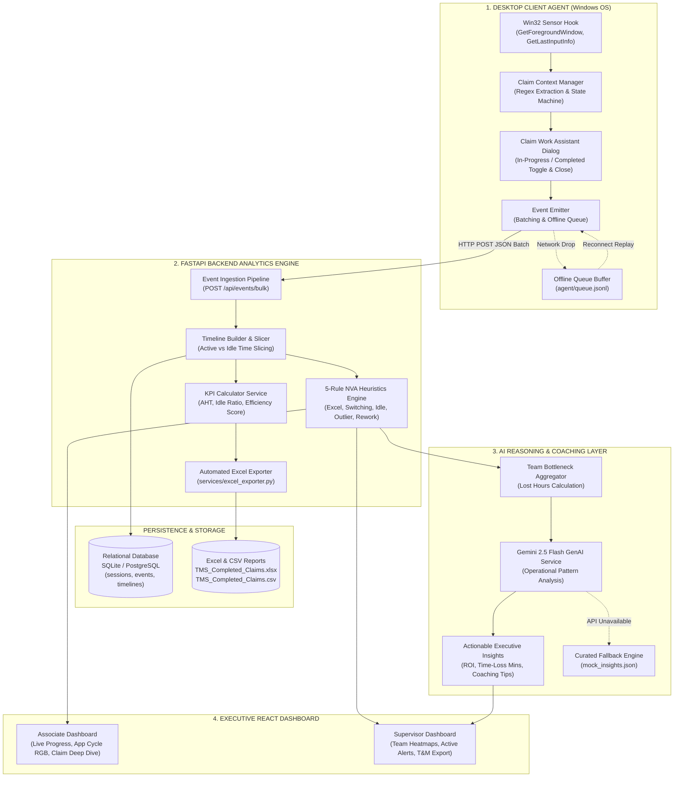
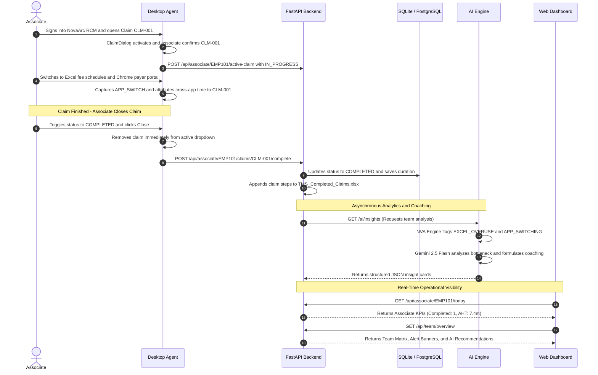

# Transaction Management System (TMS)

> **AI-Powered Telemetry and Effort Intelligence for Revenue Cycle Management**  
> *Enterprise MVP Foundation for Accounts Receivable (AR) Operations*

---

## 1. Executive Summary

In healthcare Revenue Cycle Management (RCM), Accounts Receivable (AR) associates spend their shifts processing complex medical claims across diverse, disconnected applications:

* **Primary Billing Platforms**: NovaArc RCM, ClaimPlatform, Epic, Cerner
* **Payer Portals**: Availity, UnitedHealthcare, Medicare portals accessed via Chrome and Edge
* **Offline Worksheets**: Microsoft Excel workbooks for fee schedules, contract terms, and modifier lookups
* **Communication and Documentation**: Outlook, Microsoft Teams, and Adobe Acrobat

### The Core Operational Problem

Operations executives and team managers lack objective, granular visibility into actual claim handling effort. Traditional time studies rely on manual stopwatches or self-reported logs, distorting actual associate handling times, introducing severe observer bias, and wasting 15% to 20% of productive shift capacity on administrative reporting. Furthermore, simple window-tracking utilities fail because resolving a single claim requires fluid multitasking across 3 to 5 applications simultaneously.

### The TMS Solution: Active Claim Context Tracking

TMS solves this through **Active Claim Context Tracking**:

1. **Automatic Context Detection**: When an associate selects a claim in their billing software, the desktop daemon detects the claim identifier (`CLM-001` or `CLM1003`) from the foreground window header.
2. **Context Locking Across Applications**: The agent locks that claim's context. Subsequent application switches (such as checking fee schedules in Excel or verifying coverage on a payer web portal) are automatically attributed to the active claim.
3. **Interactive Claim Assistant**: A lightweight assistant lets associates track multiple active claims, toggle statuses (`IN_PROGRESS` vs. `COMPLETED`), and close finished claims.
4. **Automated Time Slicing & Excel Generation**: The backend reassembles raw telemetry heartbeats into continuous timelines, calculates active vs. idle duration, and automatically exports completed claims into a standard 15-column Time & Motion Excel report (`TMS_Completed_Claims.xlsx`).
5. **Two-Tier Intelligence**: Sub-millisecond deterministic Lean heuristics flag operational friction (such as Excel overuse or excessive context switching), while Google Gemini 2.5 Flash analyzes aggregate team patterns to calculate financial ROI impact and provide personalized coaching recommendations.

---

## 2. Core Solution Blueprint: The "Why", "How", "Where" & Development Methodology

### System Architecture Overview Diagram



### How the 4 Core Layers Work Together

1. **Layer 1: Desktop Client Agent (The Sensory Nervous System on Windows)**  
   Runs in the background of each associate workstation with `< 1%` CPU utilization. Win32 sensor hooks capture window switches and idle durations without recording keystrokes or screen contents (100% HIPAA compliant). The Claim Context Manager isolates claim IDs using regex and attributes multi-app activity to the active claim. The Claim Work Assistant provides interactive status toggling and clean claim closure, while the Event Emitter batches telemetry and provides an offline disk queue (`queue.jsonl`).

2. **Layer 2: FastAPI Backend Analytics Engine (The Central Processing Hub)**  
   Ingests structured JSON telemetry batches, reconstructs raw window visits into unified chronological claim journeys, slices active vs. idle seconds, evaluates 5 deterministic Lean NVA rules, and appends completed claims into `TMS_Completed_Claims.xlsx` matching the standard 15-column healthcare Time & Motion format.

3. **Layer 3: AI Reasoning & Coaching Layer (The Cognitive Intelligence Brain)**  
   Evaluates aggregate shift-level metrics across the associate team. Google Gemini 2.5 Flash synthesizes operational patterns into financial ROI metrics, quantifies non-productive hours, identifies underlying system friction, and generates tailored coaching playbooks for team supervisors.

4. **Layer 4: Executive React Dashboard (The Real-Time Command Center)**  
   Provides dedicated workspaces for associates and supervisors. Associates track shift targets, view isolated claim-specific RGB application time share cycles, and review recent activity in reverse chronological order. Supervisors monitor team Average Handling Time (AHT), active/idle statuses, live friction banners, and one-click Time & Motion downloads.

---

### Solution Method Used in Development in the TMS Solution

To ensure scalability, enterprise data privacy, and sub-millisecond responsiveness, TMS was engineered using five complementary design and software methodologies:

#### 1. Non-Intrusive Event-Driven Win32 Telemetry
* **Low-Overhead Sensing**: Built on direct Windows OS API primitives (`GetForegroundWindow`, `GetWindowTextW`, and `GetLastInputInfo`) rather than resource-heavy polling or continuous screen capture.
* **Minimal Resource Footprint**: Keeps agent CPU usage under 1% and memory under 35 MB, avoiding any impact on primary billing systems.
* **Privacy-by-Design**: Telemetry is strictly metadata-driven (executable name, window title, and timestamps). Keystrokes, clipboard buffers, and screen pixels are never touched, ensuring complete HIPAA and SOC-2 compliance.

#### 2. Domain-Driven Active Claim Context State Machine
* **Dynamic Context Binding**: Uses deterministic regular expressions (`CLM-\d+` and `CLM\d+`) to identify claims upon window activation.
* **Cross-Application State Locking**: Associates frequently navigate outside their primary billing platform to check payer websites or Excel sheets. TMS implements a context state machine that locks all intermediate application visits to the currently selected claim until an explicit switch or closure occurs.
* **Explicit Lifecycle Transitions**: Enforces clean state transitions (`IN_PROGRESS` → `COMPLETED` → Closed/Dismissed), preventing cross-claim data contamination.

#### 3. Dual-Tier Analytics Pipeline (Deterministic Heuristics + Generative AI Synthesis)
* **Tier 1 (Sub-Millisecond Deterministic Lean Rules)**: Evaluates five Lean healthcare friction rules (Excel Overuse, Rapid Context Switching, Long Inactivity, Duration Outliers, and Rework Touches) synchronously in Python memory with zero API latency.
* **Tier 2 (Cognitive GenAI Reasoning with Gemini 2.5 Flash)**: Aggregates friction patterns across hundreds of claim timelines. Gemini 2.5 Flash calculates team-level financial ROI impact, lost hours, and contextual root causes, providing structured coaching cards with in-memory caching to eliminate redundant API calls.

#### 4. Decoupled Microservice Architecture with Offline Resilience
* **Contract-First Development**: All payloads adhere strictly to Draft-07 JSON Schema (`shared/event-schema.json`), standardizing communication across Python daemons, FastAPI microservices, and TypeScript frontends.
* **Offline Queue Fallback**: If network connectivity drops, the desktop agent automatically redirects events to a local append-only buffer (`agent/queue.jsonl`). When the network recovers, buffered events replay in order without data loss.
* **Decoupled Development**: The frontend includes a comprehensive mock data provider (`dashboard/src/api/mock.ts`), enabling independent UI development and testing without requiring live backend or database instances.

#### 5. Automated Standardized Operational Export Pipeline
* **Native Excel Integration**: Built with `openpyxl`, the backend automatically transforms completed claim timelines into standard 15-column healthcare Time & Motion records (`TMS_Completed_Claims.xlsx` and companion CSV).
* **Taxonomy Alignment**: Categorizes steps into Value-Added (VA), Business Value-Added (BVA), and Non-Value-Added (NVA) activities with Indian Standard Time (IST) formatting, ensuring full alignment with enterprise operations standards.

---

### A. WHY? — Purpose, Core Problems & Architectural Decisions

#### 1. The Business Need: Why Traditional Time & Motion Fails
* **Subjectivity and Waste in Manual Studies**: Traditional healthcare consulting relies on observers with stopwatches or self-reported spreadsheets (such as `Prev Entd Voice T&M.xlsx`). This introduces observer bias, disrupts associate focus, and consumes 15% to 20% of an associate's shift on administrative overhead.
* **Cross-Application Fragmentation**: Revenue cycle associates never stay inside a single application. Resolving a single claim (`CLM-001`) requires switching between billing systems (NovaArc, Epic), payer portals (Chrome, Edge), fee schedule sheets (Excel), and internal chat. Standard window trackers log these as disconnected applications; TMS connects them into a unified claim journey.

#### 2. The Architectural Choice: Why Use an AI Agent When Win32 API is Already Available?

> **The Sensory vs. Cognitive Distinction:**  
> **Win32 is the Sensory Nervous System (Eyes & Ears); the AI Agent is the Cognitive Brain (Intelligence & Decision Making).**

| Functional Capability | Win32 API Alone (Low-Level OS Hooks) | AI Agent & Intelligence Layer (The Cognitive Brain) |
| :--- | :--- | :--- |
| **Observation Scope** | Low-level OS primitives: window handles (`HWND`), process IDs, mouse idle ticks (`GetLastInputInfo`). | **Healthcare Domain Understanding**: Identifies medical claims (`CLM-001`), patient workflows, denial steps, and payer portals. |
| **Context Synthesis** | Produces thousands of disconnected window titles with no correlation between applications. | **Context State Machine**: Binds multi-application transitions across Chrome, Excel, and EHR to the active claim. |
| **Operational Friction Analysis** | Cannot distinguish between productive research, confusion, or bottlenecked waiting. | **5 Deterministic Lean Heuristics**: Automatically flags Excel Overuse (>40%), Context Thrashing (≥8 switches), Idle Gaps (≥180s), Outliers (≥20m), and Rework. |
| **Executive Intelligence & ROI** | Emits raw numbers with zero operational or financial context. | **Generative AI Coaching (Gemini 2.5 Flash)**: Translates shift seconds into financial ROI, operational lost hours, and personalized coaching playbooks. |

#### 3. Privacy by Design: Why Zero-PHI / Zero-PBI?
* **100% HIPAA and SOC-2 Compliant**: The desktop agent inspects **only executable names and window titles**. It **never records keystrokes**, captures screenshots, or accesses clipboard contents. Patient health information (PHI) never leaves the local workstation.

---

### B. HOW? — Implementation Mechanics & End-to-End Workflow

#### 1. Foreground Capture & Context Locking
* `WindowTracker` registers Win32 hooks to intercept foreground window transitions with `< 1%` CPU utilization.
* `ClaimContextManager` applies regex extraction (`CLM-\d+`) to isolate active claim IDs and dynamically locks cross-application activity (such as Excel lookups or Chrome portal checks) to that claim.

#### 2. Interactive Claim Work Assistant (Desktop & Dashboard)
* **Automatic Activation**: Opens automatically when an associate signs into NovaArc RCM or switches to other applications.
* **Inline Status Toggle (`IN_PROGRESS` ↔ `COMPLETED`)**: In the dropdown, active claims display an interactive badge toggling between active processing (`IN_PROGRESS`, amber) and completion (`COMPLETED`, emerald).
* **One-Click Dynamic `Close` Action**:
  1. The `Close` button appears beside a claim once it is marked `COMPLETED`.
  2. Clicking `Close` immediately removes the claim from the active dropdown so the associate has a clean view for their next claim.
  3. Updates the claim status to `COMPLETED` across the database and live dashboard.
  4. Automatically appends the claim's workflow steps to `TMS_Completed_Claims.xlsx` (and companion CSV) in the standard 15-column format.
  5. Preserves all historical metrics, time distributions, and NVA tags in the dashboard's audit log.

#### 3. Intelligent Time Slicing & Heuristic Friction Detection
* The FastAPI backend reassembles raw heartbeat events into clean `ClaimTimeline` entries.
* Timestamps are sliced into active versus idle seconds.
* The 5-Rule NVA Engine flags operational bottlenecks in real time:
  * **Rule 1 (EXCEL_OVERUSE)**: Excel active time ≥ 40% of duration (minimum 180s).
  * **Rule 2 (APP_SWITCHING)**: Context toggles ≥ 8 switches per claim.
  * **Rule 3 (LONG_IDLE)**: Continuous or accumulated idle time ≥ 180s.
  * **Rule 4 (OUTLIER)**: Total claim duration ≥ 1200s (20 minutes).
  * **Rule 5 (REWORK)**: Same claim handled across multiple distinct sessions/touches.

#### 4. Automated Time & Motion Excel Generation
* When a claim is closed, `services.excel_exporter` uses `openpyxl` to format standard Time & Motion taxonomy steps (Login, Pre-service analysis, EOB review, Insurance call, Notes documentation) with durations, categories (VA, BVA, NVA), and IST timestamps.

#### 5. Generative AI Coaching (Gemini 2.5 Flash)
* The AI service analyzes team-level aggregate friction patterns across the shift.
* It calculates total lost hours, estimates financial impact, and outputs structured insight cards with root-cause analysis and actionable coaching recommendations.

---

### C. WHERE? — System Boundaries, Architecture Locations & File Manifest

| Architectural Layer | Physical Directory | Runtime Environment & Port | Key Responsibilities & Primary Source Files |
| :--- | :--- | :--- | :--- |
| **Desktop Telemetry Daemon** | `agent/` | Windows 10/11 Client Daemon | Win32 hooks, idle tracking, floating Claim Work Assistant dialog.<br>• `tracker.py`, `idle_monitor.py`<br>• `dialog.py`, `main.py` |
| **Core API & Analytics Engine** | `backend/` | Python / FastAPI<br>`http://localhost:8000` | Bulk event ingestion, timeline builder, KPI calculation, automated Excel export.<br>• `routes/associate.py`, `services/timeline_builder.py`<br>• `services/excel_exporter.py`, `models.py` |
| **AI Intelligence Service** | `ai/` | Python / FastAPI<br>`http://localhost:8001` | 5 Lean NVA rules engine, team bottleneck aggregation, Gemini 2.5 Flash coaching.<br>• `nva_engine.py`, `gemini_insights.py`<br>• `team_aggregator.py` |
| **Executive Web Dashboard** | `dashboard/` | React 18 + Vite + TypeScript<br>`http://localhost:5173` | Associate shift workspace, RGB time cycles, supervisor team overview, claim audit trail.<br>• `pages/AssociateDashboard.tsx`<br>• `components/ClaimWorkAssistantModal.tsx` |
| **Persistence & Export Storage** | Root & `backend/` | Local SQLite / PostgreSQL | Database storage (`tms.db`) and Time & Motion exports:<br>• `TMS_Completed_Claims.xlsx`<br>• `TMS_Completed_Claims.csv` |
| **Shared Contracts** | `shared/` | Contract Repository | Single Source of Truth for JSON Schemas and application mapping dictionaries.<br>• `event-schema.json`, `app-map.json` |

---

## 3. End-to-End Operational Workflow

The following sequence illustrates a typical claim processing lifecycle from foreground capture to supervisor intelligence and automated Excel export:



### Step-by-Step Workflow Breakdown

1. **Claim Initiation**: The associate opens a claim (`CLM-001`) in NovaArc RCM. The desktop agent detects the claim ID from the window header and sets the active context to `IN_PROGRESS`.
2. **Context-Locked Multitasking**: When the associate switches between Excel fee schedules and Chrome payer portals, the agent attributes all elapsed time directly to `CLM-001`.
3. **Completion & Dismissal**: Upon finishing the claim, the associate changes the status badge to `COMPLETED` and clicks `Close`. The claim disappears from the active assistant dropdown immediately.
4. **Automated Excel Export**: The backend marks the claim complete in the database and automatically writes the claim's workflow steps to `TMS_Completed_Claims.xlsx` matching the standard 15-column format.
5. **Real-Time Visibility & Coaching**: The dashboard updates associate KPIs instantly, while the AI service calculates team friction patterns and surfaces actionable coaching insights for supervisors.

---

## 4. Module Ownership and Documentation

The repository is organized into four decoupled modules and a shared contracts directory. Each folder contains its own dedicated **`README.md`** detailing its specific architecture, component map, and implementation tasks:

| Module Directory | Team Owner | Dedicated Documentation | Primary Technical Responsibilities |
| :--- | :--- | :--- | :--- |
| **`shared/`** | **All Members** | [Shared Contracts Guide](file:///b:/Projects/TMS/shared/README.md) | Single Source of Truth for event JSON Schema, process mapping dictionary, and claim regular expressions. |
| **`agent/`** | **Member 1** | [Desktop Agent Guide](file:///b:/Projects/TMS/agent/README.md) | Windows daemon, Win32 API hooks, idle detection, active claim state machine, Claim Work Assistant dialog, and tray icon. |
| **`backend/`** | **Member 2** | [Backend API Guide](file:///b:/Projects/TMS/backend/README.md) | FastAPI service, async SQLAlchemy ORM models, bulk ingestion, timeline builder, KPI calculator, and automated Excel export. |
| **`ai/`** | **Member 3** | [AI Engine Guide](file:///b:/Projects/TMS/ai/README.md) | 5 NVA rules engine, team aggregator, Gemini 2.5 Flash prompt engine, in-memory caching, and microservice endpoints. |
| **`dashboard/`** | **Member 4** | [Dashboard Guide](file:///b:/Projects/TMS/dashboard/README.md) | React 18 + Vite + TypeScript SaaS frontend, 2D Sharp UI design system, dual-mode API client, and analytics views. |

---

## 5. Repository Structure

```text
TMS/
├── shared/                         # Data standards and schemas
│   ├── event-schema.json           # JSON Schema specification for agent events
│   ├── app-map.json                # Executable process name to canonical app mapping
│   └── README.md                   # Shared standards guide
│
├── agent/                          # Member 1: Desktop Agent
│   ├── tracker.py                  # Foreground window tracker and regex extractor
│   ├── idle_monitor.py             # Win32 GetLastInputInfo user inactivity monitor
│   ├── claim_context.py            # Active claim context attribution state machine
│   ├── dialog.py                   # Tkinter Claim Work Assistant (Interactive Status & Close)
│   ├── emitter.py                  # Event batcher with offline disk queue (.jsonl)
│   ├── tray.py                     # Windows notification area system tray icon
│   ├── mock_backend.py             # Standalone HTTP test server
│   ├── config.json                 # Agent intervals and thresholds
│   ├── main.py                     # Agent daemon entrypoint
│   └── README.md                   # Member 1 architecture and implementation guide
│
├── backend/                        # Member 2: Core API and Database
│   ├── database.py                 # Async SQLAlchemy engine (SQLite / PostgreSQL)
│   ├── models.py                   # 5 ORM models (Associate, Session, Event, Timeline, Summary)
│   ├── schemas.py                  # Pydantic validation schemas
│   ├── routes/                     # FastAPI route controllers
│   │   ├── events.py               # POST /api/events (Bulk ingestion)
│   │   ├── sessions.py             # POST /api/sessions/start, /end
│   │   ├── associate.py            # GET /today, POST /complete, POST /status
│   │   ├── team.py                 # GET /api/team/overview, /export-tm
│   │   └── ai_proxy.py             # GET /api/insights (AI microservice proxy)
│   ├── services/                   # Core business logic
│   │   ├── timeline_builder.py     # Duration calculation and event aggregation
│   │   ├── kpi_calculator.py       # AHT, idle ratio, and efficiency score calculation
│   │   └── excel_exporter.py       # Automated openpyxl Prev Entd Voice T&M Excel exporter
│   ├── mock_responses/             # Static mock JSON payloads for frontend development
│   ├── main.py                     # FastAPI application entrypoint
│   └── README.md                   # Member 2 architecture and implementation guide
│
├── ai/                             # Member 3: AI Intelligence Engine
│   ├── nva_engine.py               # 5 Non-Value-Added operational friction rules
│   ├── team_aggregator.py          # Team bottleneck and lost hours calculator
│   ├── gemini_insights.py          # Gemini 2.5 Flash prompt engine with TTL cache
│   ├── sample_timelines.json       # 30 realistic test claims for offline tuning
│   ├── mock_insights.json          # Curated fallback recommendation cards
│   ├── main.py                     # FastAPI microservice entrypoint (Port 8001)
│   └── README.md                   # Member 3 architecture and implementation guide
│
├── dashboard/                      # Member 4: SaaS Web Frontend
│   ├── src/
│   │   ├── api/                    # API communication layer (client.ts, types.ts, mock.ts)
│   │   ├── components/             # UI Components (ClaimWorkAssistantModal, KpiCard, etc.)
│   │   ├── pages/                  # AssociateDashboard, SupervisorDashboard, ClaimDeepDive
│   │   ├── config.ts               # Configuration tokens and color palette
│   │   ├── index.css               # 2D Sharp SaaS design system
│   │   └── App.tsx                 # View state container and routing
│   ├── package.json                # React 18, Vite, Lucide icons
│   └── README.md                   # Member 4 architecture and implementation guide
│
├── TMS_Completed_Claims.xlsx       # Live Excel Time & Motion export matching standard schema
├── TMS_Completed_Claims.csv        # Live CSV companion export
├── verify_core.py                  # Automated multi-subsystem integrity verification script
├── requirements.txt                # Unified repository dependencies (includes openpyxl)
└── README.md                       # Master project architecture guide
```

---

## 6. Quickstart: Running the Platform

### Step 1: Install Dependencies

Install all Python dependencies across the core backend, AI microservice, and desktop agent directly from the repository root:

```bash
pip install -r requirements.txt
```

Install frontend dependencies:

```bash
cd dashboard
npm install
cd ..
```

### Step 2: Run the Verification Suite

Run the centralized verification test suite to confirm all schemas, data contracts, and rule engines are fully operational:

```bash
python verify_core.py
```

Expected output: `SUCCESS: ALL TMS CORE MODULES VERIFIED AND OPERATIONAL!`

### Step 3: Start the Subsystems (In 4 Separate Terminals)

#### Terminal 1 — Backend Core API (Port 8000)

```bash
cd backend
python -m uvicorn main:app --host 127.0.0.1 --port 8000 --reload
```

* Interactive Swagger API Documentation: `http://localhost:8000/docs`
* Health check: `http://localhost:8000/health`
* *Note*: Automatically provisions `tms.db` and baseline associate `EMP101` if not present.

#### Terminal 2 — AI Intelligence Microservice (Port 8001)

```bash
cd ai
python -m uvicorn main:app --host 127.0.0.1 --port 8001 --reload
```

* AI service endpoints: `http://localhost:8001/ai/insights`

#### Terminal 3 — Web Dashboard (Port 5173)

```bash
cd dashboard
npm run dev
```

* Open your browser at: `http://localhost:5173`
* **Associate Workspace**: Real-time telemetry, claim KPI progress, and isolated Application Time Share cycle.
* **Supervisor Overview**: Team performance matrix, NVA friction summary, and Gemini operational insights.
* **Claim Deep Dive**: Audit stream with reverse-chronological event sequencing (latest timestamp on top).

#### Terminal 4 — Desktop Telemetry Agent

```bash
cd agent
python main.py
```

* Runs the background telemetry agent on Windows.
* Monitors foreground window transitions and attributes activity to the active claim.
* The Claim Work Assistant modal activates upon NovaArc platform sign-in and application switching.

---

## 7. Key Operational & UX Capabilities

1. **Interactive Claim Status Toggling & Automated Excel Export**  
   In the Claim Work Assistant dropdown (available in both the Desktop Tkinter assistant and the Web Modal), existing claims display an interactive badge toggling between `IN_PROGRESS` (amber) and `COMPLETED` (emerald). When marked `COMPLETED`, a dedicated `Close` button appears. Clicking `Close` immediately removes the claim from the active dropdown, updates the backend database and live dashboard to `COMPLETED`, and appends formatted Time & Motion records into `TMS_Completed_Claims.xlsx` matching the standard 15-column schema. All historical metrics remain permanently accessible in the dashboard audit trail.

2. **Reverse Chronological Event Audit Trail (Claim Deep Dive)**  
   In the Claim Deep Dive view, all captured telemetry events render in reverse chronological order (newest timestamp on top). Supervisors and associates can inspect the most recent interactions instantly without scrolling through lengthy logs.

3. **Vibrant RGB Application Time Share Cycle**  
   The analytical donut chart uses curated, high-saturation, distinct RGB colors for each application and browser (strictly non-grey). Known enterprise applications (NovaArc RCM, ClaimPlatform, Chrome, Edge, Excel, TMS Dashboard) feature custom brand hues, while dynamic web pages receive deterministic high-contrast RGB colors.

4. **Claim-Isolated Time Share (Starts Empty for Every New Claim)**  
   The application time share cycle strictly reflects the time spent on the currently active claim. Whenever an associate enters or switches to a new claim ID, the donut cycle starts completely empty (0 time), ensuring prior claims' metrics are never mixed into the new claim context.

5. **Collaborator & Multi-Developer Readiness**  
   A unified root `requirements.txt` eliminates missing dependency errors on fresh checkouts. Dynamic path resolution in `backend/main.py` and `ai/main.py` allows running commands from either the repository root or module subfolders. Automatic database table creation and baseline associate provisioning ensure smooth onboarding on fresh clones.

---

## 8. Engineering Standards and Team Guidelines

1. **Schema Adherence**: Any modification to event structures must be updated in `shared/event-schema.json` before updating agent or backend models.
2. **Offline Resilience**: The desktop agent must never lose data during network disconnections. Events buffer to `queue.jsonl` and drain sequentially upon reconnection.
3. **Decoupled Development**: The dashboard contains full mock data fixtures (`dashboard/src/api/mock.ts`) allowing UI development without requiring local backend or database services to be running.
4. **Code Quality**: All Python code includes type hints and docstrings. TypeScript interfaces remain synchronized with backend Pydantic models.