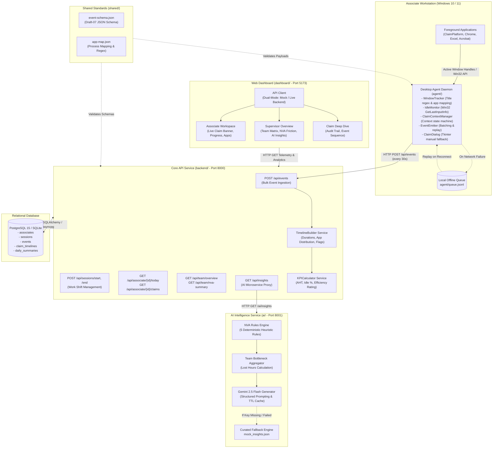

# Transaction Management System (TMS)

**AI-Powered Telemetry and Effort Intelligence for Revenue Cycle Management**  
*Enterprise MVP Foundation for Accounts Receivable (AR) Operations*

---

## 1. Executive Summary

In healthcare Revenue Cycle Management (RCM), Accounts Receivable associates spend their working shifts processing medical claims across disparate systems:
- Primary Billing Platforms (e.g., ClaimPlatform, Epic, Cerner)
- Payer Portals (e.g., Availity, UnitedHealthcare, Medicare portals)
- Offline Worksheets (Microsoft Excel spreadsheets for fee schedules and modifier lookup)
- Communication and Documentation Tools (Outlook, Teams, Adobe Acrobat)

### The Core Operational Problem
Operations managers currently lack granular visibility into how long claims take to resolve. Manual time logs are inaccurate, and simple window tracking fails because an associate actively switches between 3 to 5 applications to work on a single claim.

### The TMS Solution: Active Claim Context Tracking
TMS introduces **Active Claim Context Tracking**:
1. When an associate opens a claim in their billing software, the lightweight desktop agent detects the claim identifier (`CLM\d+`) from the window title.
2. The agent activates that claim's context (e.g., `Active Claim = CLM1003`).
3. Every subsequent window visit (Excel, Chrome, Acrobat) is automatically attributed to `CLM1003` until another claim is opened or the current claim is completed.
4. The backend reassembles these telemetry events into clean claim timelines with application time distributions.
5. The AI rules engine and Google Gemini identify Non-Value-Added (NVA) friction points—such as excessive spreadsheet lookups, rapid context toggling, and extended idle gaps—delivering actionable coaching insights to team supervisors.

---

## 2. Full System Architecture

### High-Level System Architecture Diagram



---

## 3. End-to-End Operational Workflow

The following sequence illustrates a typical claim processing lifecycle from foreground capture to supervisor intelligence:

```mermaid
sequenceDiagram
    autonumber
    actor Associate as Associate
    participant Agent as Desktop Agent (Member 1)
    participant Backend as FastAPI Backend (Member 2)
    participant DB as PostgreSQL (Member 2)
    participant AI as AI Engine (Member 3)
    participant Dashboard as Web Dashboard (Member 4)

    Associate->>Agent: Opens Claim CLM1026 in ClaimPlatform
    Agent->>Agent: WindowTracker matches regex 'CLM1026' in window title
    Agent->>Agent: ClaimContextManager sets active context = 'CLM1026'

    Associate->>Agent: Switches to Excel to look up fee schedule modifier
    Agent->>Agent: Captures APP_SWITCH; attributes Excel activity to CLM1026

    Associate->>Agent: Submits claim; opens next claim CLM1027
    Agent->>Agent: Context switches to CLM1027; marks CLM1026 ready for completion

    Agent->>Backend: POST /api/events (Flushes batch of 10 events)
    Backend->>DB: Persists raw Event records
    Backend->>Backend: TimelineBuilder calculates durations, app breakdown, and switch count
    Backend->>DB: Upserts ClaimTimeline record (CLM1026: 900s total, Excel=390s, Switches=12)

    Note over Backend,AI: Asynchronous Analytics & AI Recommendation Engine
    Backend->>AI: GET /ai/insights (Requests team analysis)
    AI->>AI: NVA Engine flags EXCEL_OVERUSE (>40%) and APP_SWITCHING (>=8)
    AI->>AI: Gemini 2.5 Flash analyzes bottleneck and formulates recommendation
    AI-->>Backend: Returns structured JSON insight cards

    Note over Backend,Dashboard: Real-Time Operational Visibility
    Dashboard->>Backend: GET /api/associate/EMP101/today
    Backend-->>Dashboard: Returns Associate Today KPIs (AHT: 7.4m, Active Claim: CLM1027)
    Dashboard->>Backend: GET /api/team/overview
    Backend-->>Dashboard: Returns Team Matrix, Alert Banners, and AI Recommendations
```

---

## 4. Module Ownership and Documentation

The repository is organized into four decoupled modules and a shared contracts directory. Each folder contains its own dedicated **`README.md`** detailing its specific architecture, component map, and implementation tasks:

| Module Directory | Team Owner | Dedicated Documentation | Primary Technical Responsibilities |
| :--- | :--- | :--- | :--- |
| **`shared/`** | **All Members** | [Shared Contracts Guide](file:///b:/Projects/TMS/shared/README.md) | Single Source of Truth for event JSON Schema, process mapping dictionary, and claim regular expressions. |
| **`agent/`** | **Member 1** | [Desktop Agent Guide](file:///b:/Projects/TMS/agent/README.md) | Windows daemon, Win32 API hooks, idle detection, active claim state machine, hotkey trigger, and PyInstaller packaging. |
| **`backend/`** | **Member 2** | [Backend API Guide](file:///b:/Projects/TMS/backend/README.md) | FastAPI service, async SQLAlchemy 2.0 ORM models, bulk ingestion route, timeline builder, KPI calculator, and migrations. |
| **`ai/`** | **Member 3** | [AI Engine Guide](file:///b:/Projects/TMS/ai/README.md) | 5 NVA rules engine, team aggregator, Gemini 2.5 Flash prompt engine, in-memory caching, and microservice endpoints. |
| **`dashboard/`** | **Member 4** | [Dashboard Guide](file:///b:/Projects/TMS/dashboard/README.md) | React 18 + Vite + TypeScript SaaS frontend, dark glassmorphic design system, dual-mode API client, and analytics views. |

---

## 5. Repository Structure

```
TMS/
├── shared/                         # Data standards and schemas
│   ├── event-schema.json           # JSON Schema specification for agent events
│   ├── app-map.json                # Executable process name to canonical app mapping
│   └── README.md                   # Shared standards guide
│
├── agent/                          # Member 1: Desktop Agent
│   ├── tracker.py                  # Foreground window tracker and regex extractor
│   ├── idle_monitor.py             # Win32 GetLastInputInfo user inactivity monitor
│   ├── claim_context.py            # Active claim context attribution state machine
│   ├── dialog.py                   # Tkinter fallback claim entry modal
│   ├── emitter.py                  # Event batcher with offline disk queue (.jsonl)
│   ├── tray.py                     # Windows notification area system tray icon
│   ├── mock_backend.py             # Standalone HTTP test server
│   ├── config.json                 # Agent intervals and thresholds
│   ├── main.py                     # Agent daemon entrypoint
│   └── README.md                   # Member 1 architecture and implementation guide
│
├── backend/                        # Member 2: Core API and Database
│   ├── database.py                 # Async SQLAlchemy engine (SQLite / PostgreSQL)
│   ├── models.py                   # 5 ORM models (Associate, Session, Event, Timeline, Summary)
│   ├── schemas.py                  # Pydantic validation schemas
│   ├── routes/                     # FastAPI route controllers
│   │   ├── events.py               # POST /api/events (Bulk ingestion)
│   │   ├── sessions.py             # POST /api/sessions/start, /end
│   │   ├── associate.py            # GET /api/associate/{id}/today, /claims
│   │   ├── team.py                 # GET /api/team/overview, /nva-summary
│   │   └── ai_proxy.py             # GET /api/insights (AI microservice proxy)
│   ├── services/                   # Core business logic
│   │   ├── timeline_builder.py     # Duration calculation and event aggregation
│   │   └── kpi_calculator.py       # AHT, idle ratio, and efficiency score calculation
│   ├── mock_responses/             # Static mock JSON payloads for frontend development
│   ├── docker-compose.yml          # Container configuration for PostgreSQL, Backend, and AI
│   ├── main.py                     # FastAPI application entrypoint
│   └── README.md                   # Member 2 architecture and implementation guide
│
├── ai/                             # Member 3: AI Intelligence Engine
│   ├── nva_engine.py               # 5 Non-Value-Added operational friction rules
│   ├── team_aggregator.py          # Team bottleneck and lost hours calculator
│   ├── gemini_insights.py          # Gemini 2.5 Flash prompt engine with TTL cache
│   ├── sample_timelines.json       # 30 realistic test claims for offline tuning
│   ├── mock_insights.json          # Curated fallback recommendation cards
│   ├── main.py                     # FastAPI microservice entrypoint (Port 8001)
│   └── README.md                   # Member 3 architecture and implementation guide
│
├── dashboard/                      # Member 4: SaaS Web Frontend
│   ├── src/
│   │   ├── api/                    # API communication layer
│   │   │   ├── types.ts            # TypeScript interfaces matching backend models
│   │   │   ├── mock.ts             # Complete mock fixtures for offline UI development
│   │   │   └── client.ts           # Dual-mode API client (Mock vs Live backend)
│   │   ├── components/             # Reusable UI components
│   │   │   ├── Navbar.tsx          # Top navigation with live status and mode switch
│   │   │   ├── KpiCard.tsx         # Metric display card with trend indicators
│   │   │   ├── NvaBadge.tsx        # Colored badges for NVA flags
│   │   │   ├── AppBreakdownBar.tsx # Multi-color horizontal progress bar
│   │   │   ├── InsightCard.tsx     # Gemini recommendation display card
│   │   │   └── ClaimTimelineView.tsx # Chronological event stream and durations
│   │   ├── pages/                  # Top-level view containers
│   │   │   ├── AssociateDashboard.tsx # Associate shift workspace
│   │   │   ├── SupervisorDashboard.tsx # Team operations overview
│   │   │   └── ClaimDeepDive.tsx   # Single claim audit investigation
│   │   ├── config.ts               # Configuration tokens and color palette
│   │   ├── index.css               # Dark mode SaaS design system
│   │   └── App.tsx                 # View state container and routing
│   ├── package.json                # React 18, Vite, Lucide icons
│   └── README.md                   # Member 4 architecture and implementation guide
│
├── verify_core.py                  # Automated multi-subsystem integrity verification script
└── README.md                       # Master project architecture guide
```

---

## 6. Quickstart: Running the Platform

### Step 1: Install Dependencies
Install all Python dependencies across the core backend, AI microservice, and desktop agent directly from the repository root:
```bash
pip install -r requirements.txt
```
*(Alternatively, dependencies can be installed individually inside `backend/requirements.txt`, `ai/requirements.txt`, and `agent/requirements.txt`)*.

Install frontend dependencies:
```bash
cd dashboard
npm install
cd ..
```

### Step 2: Run the Verification Suite
Run the centralized verification test suite to confirm all schemas, data contracts, and rule engines are fully operational:
```bash
python verify_core.py
```
Expected output: `SUCCESS: ALL TMS CORE MODULES VERIFIED AND OPERATIONAL!`

### Step 3: Start the Subsystems (In 4 Separate Terminals)

#### Terminal 1 — Backend Core API (Port 8000)
```bash
cd backend
python -m uvicorn main:app --host 127.0.0.1 --port 8000 --reload
```
- Interactive Swagger API Documentation: `http://localhost:8000/docs`
- Health check: `http://localhost:8000/health`
- *Note*: On fresh checkouts without a database, `init_db()` automatically provisions `tms.db` and baseline associate `EMP101`.

#### Terminal 2 — AI Intelligence Microservice (Port 8001)
```bash
cd ai
python -m uvicorn main:app --host 127.0.0.1 --port 8001 --reload
```
- AI service endpoints: `http://localhost:8001/ai/insights`

#### Terminal 3 — Web Dashboard (Port 5173)
```bash
cd dashboard
npm run dev
```
- Open your browser at: `http://localhost:5173`
- **Associate Workspace**: Real-time telemetry, claim KPI progress, and isolated Application Time Share cycle.
- **Supervisor Overview**: Team performance matrix, NVA friction summary, and Gemini operational insights.
- **Claim Deep Dive**: Audit stream with reverse-chronological event sequencing (latest timestamp on top).

#### Terminal 4 — Desktop Telemetry Agent
```bash
cd agent
python main.py
```
- Runs the background telemetry agent on Windows.
- Monitors foreground window transitions and attribute activity to the active claim.
- The Claim Work Assistant modal activates upon NovaArc platform sign-in and application switching.

---

## 7. Key Operational & UX Capabilities

1. **Reverse Chronological Event Audit Trail (Claim Deep Dive)**:
   - In the **Claim Deep Dive** view, all captured telemetry events are rendered with the **latest timestamp at the top** (newest first). Supervisors and associates can inspect the most recent interactions instantly without scrolling to the bottom.

2. **Vibrant RGB Application Time Share Cycle**:
   - The analytical donut chart uses curated, high-saturation, distinct RGB colors for each application and browser (strictly non-grey).
   - Known enterprise applications (`NovaArc RCM`, `ClaimPlatform`, `Chrome`, `Edge`, `Excel`, `TMS Dashboard`, etc.) feature custom brand hues, while dynamic web pages and tools receive deterministic high-contrast RGB colors.

3. **Claim-Isolated Time Share (Starts Empty for Every New Claim)**:
   - The application time share cycle strictly reflects the time spent on the **currently active claim**.
   - Whenever an associate enters or switches to a new claim ID, the donut cycle starts **completely empty** (`0 time`), ensuring prior claims' metrics are not mixed into the new claim context.

4. **Collaborator & Multi-Developer Readiness**:
   - Unified root [`requirements.txt`](file:///b:/Projects/TMS/requirements.txt) eliminates missing dependency errors on fresh checkouts.
   - Dynamic `sys.path` directory resolution in `backend/main.py` and `ai/main.py` supports running commands from either repository root or module subfolders.
   - Automatic database table creation and baseline associate provisioning on fresh `git clone` setups.

---

## 8. Engineering Standards and Team Guidelines

1. **Schema Adherence**: Any modification to event structures must be updated in [`shared/event-schema.json`](file:///b:/Projects/TMS/shared/event-schema.json) before updating agent or backend models.
2. **Offline Resilience**: The desktop agent must never lose data during network disconnections. Events buffer to `queue.jsonl` and drain sequentially upon reconnection.
3. **Decoupled Development**: The dashboard contains full mock data fixtures ([`dashboard/src/api/mock.ts`](file:///b:/Projects/TMS/dashboard/src/api/mock.ts)) allowing UI development without requiring local backend or database services to be running.
4. **Code Quality**: All Python code includes type hints and docstrings. TypeScript interfaces remain synchronized with backend Pydantic models.