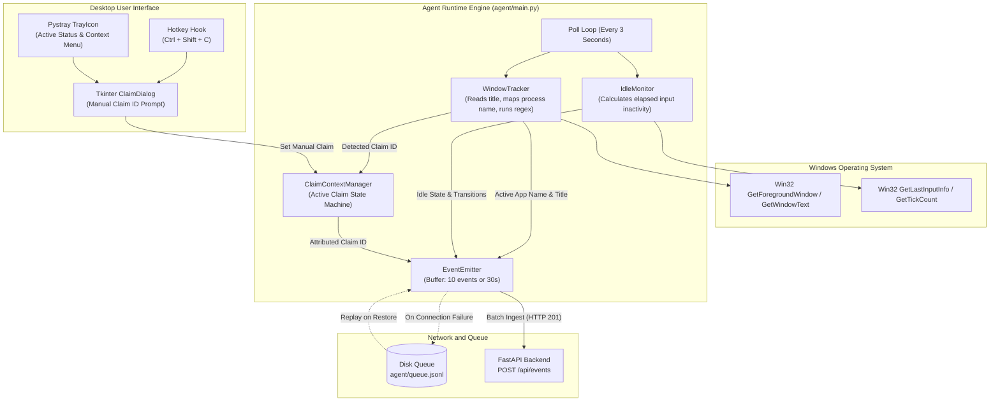
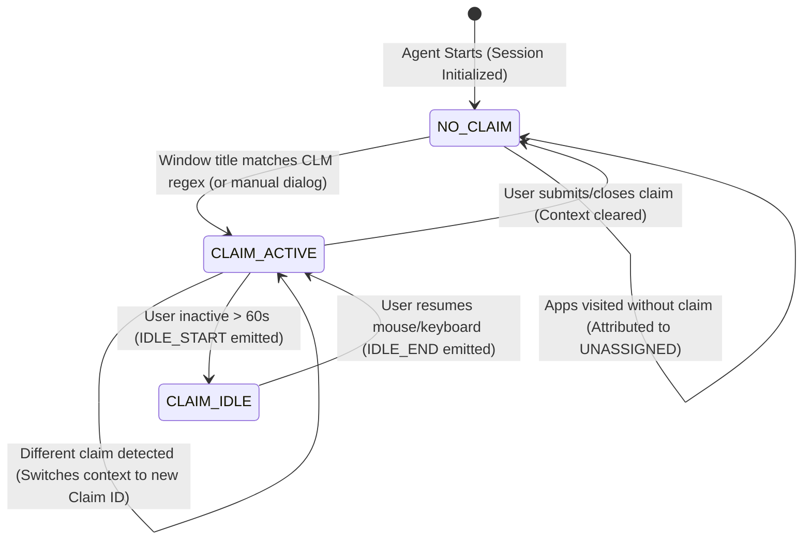

# Windows Desktop Agent (`agent/`)

**Windows Telemetry Daemon and Claim Context Tracker**  
*Lead Engineer: Member 1 (Client / Windows Desktop Engineer)*

---

## 1. Module Overview and Responsibility

The Desktop Agent is a lightweight background process running on associate workstations (Windows 10/11). It monitors active user engagement, attributes disparate desktop applications to active healthcare claims, and buffers telemetry to the backend.

### Key Operational Goals
1. **Low Footprint**: Consumes strictly under 1% CPU and less than 50 MB of memory.
2. **Context Continuity**: When an associate moves from a claim screen to Excel to look up a modifier, Excel time must be attributed to that specific claim.
3. **Zero Data Loss**: If the backend goes down or the network drops, events buffer to disk (`queue.jsonl`) and replay sequentially when connectivity returns.

---

## 2. Module Architecture and Flow

### Subsystem Component Architecture



### Active Claim Context State Machine



---

## 3. Implemented Inventory

| File | Component / Class | Current Responsibility |
| :--- | :--- | :--- |
| [`config.json`](file:///b:/Projects/TMS/agent/config.json) | Configuration | Stores polling interval (`3s`), idle threshold (`60s`), batch size (`10`), and backend endpoints. |
| [`tracker.py`](file:///b:/Projects/TMS/agent/tracker.py) | `WindowTracker` | Inspects foreground window handle, maps executable to app name via `shared/app-map.json`, and extracts `CLM\d{4,8}`. |
| [`idle_monitor.py`](file:///b:/Projects/TMS/agent/idle_monitor.py) | `IdleMonitor` | Native Windows `GetLastInputInfo` wrapper. Measures elapsed milliseconds without user interaction; emits `IDLE_START` and `IDLE_END`. |
| [`claim_context.py`](file:///b:/Projects/TMS/agent/claim_context.py) | `ClaimContextManager` | Manages active claim context state machine. Maintains claim identity across multi-window work sessions. |
| [`dialog.py`](file:///b:/Projects/TMS/agent/dialog.py) | `ClaimDialog` | Dark-themed Tkinter input modal prompting associate for manual claim entry with regex format validation. |
| [`emitter.py`](file:///b:/Projects/TMS/agent/emitter.py) | `EventEmitter` | In-memory event buffer with automatic HTTP POST batching and local disk fallback (`queue.jsonl`). |
| [`tray.py`](file:///b:/Projects/TMS/agent/tray.py) | `TrayIcon` | System tray icon displaying associate ID, current active claim, manual entry trigger, and shutdown options. |
| [`mock_backend.py`](file:///b:/Projects/TMS/agent/mock_backend.py) | Mock Test Server | Standalone HTTP server for verifying agent telemetry emission without running the full backend stack. |
| [`main.py`](file:///b:/Projects/TMS/agent/main.py) | Main Daemon Loop | Wires subsystems together, handles signal termination, and controls the 3-second evaluation loop. |

---

## 4. What to Implement Further

1. **PyInstaller Standalone Executable Packaging (`agent/build.spec`)**:
   - Package all Python dependencies, config files, and assets into a single portable `TMS-Agent.exe`.
2. **Global Hotkey Trigger (`Ctrl + Shift + C`)**:
   - Enable an associate to invoke the manual ClaimDialog modal from any active application.
3. **Untracked Application Warning**:
   - If an associate spends more than 5 minutes actively working in unassigned windows, prompt them to assign an active claim.
4. **Resilience and Buffer Drain Validation**:
   - Verify that simulated network outages successfully persist events to `queue.jsonl` and drain without record duplication upon reconnection.
5. **Resource Benchmarking**:
   - Confirm agent CPU utilization remains strictly below 1% during continuous polling.

---

## 5. How to Implement

### Step 1: Compiling with PyInstaller
Create `agent/build.spec` or run the following command from the `agent/` directory:
```bash
pip install pyinstaller
pyinstaller --noconsole --onefile --name "TMS-Agent" --add-data "config.json;." --add-data "../shared/app-map.json;shared" main.py
```
The compiled binary will be placed in `agent/dist/TMS-Agent.exe`.

### Step 2: Adding Global Hotkey Hook
In `agent/main.py`, integrate `pynput.keyboard.GlobalHotKeys`:
```python
from pynput import keyboard
from dialog import ClaimDialog

def handle_hotkey_claim_entry():
    """Triggered on Ctrl+Shift+C from any active window."""
    dialog = ClaimDialog(on_submit=lambda cid: agent.claim_context.set_manual_claim(cid))
    dialog.show(current_claim=agent.claim_context.get_current_claim_id())

hotkey_thread = keyboard.GlobalHotKeys({
    '<ctrl>+<shift>+c': handle_hotkey_claim_entry
})
hotkey_thread.start()
```

### Step 3: Implementing Untracked Inactivity Reminder
Within the main monitoring loop in `agent/main.py`:
```python
if self.claim_context.get_current_claim_id() == "UNASSIGNED":
    self.untracked_seconds += self.config["poll_interval_sec"]
    if self.untracked_seconds >= 300:  # 5 minutes without assigned claim
        print("[Agent Alert] 5 minutes active without assigned claim context.")
        handle_hotkey_claim_entry()
        self.untracked_seconds = 0
else:
    self.untracked_seconds = 0
```

---

## 6. How to Run and Test

```bash
cd agent
pip install -r requirements.txt

# Option A: Isolated Test Run (with local mock server)
# Terminal 1:
python mock_backend.py
# Terminal 2:
python main.py

# Option B: Integration Run (with live FastAPI backend running on port 8000)
python main.py
```
Open Notepad or Excel, rename a test document to include `CLM1003` in the window title, and watch the console stream active claim attribution events!
