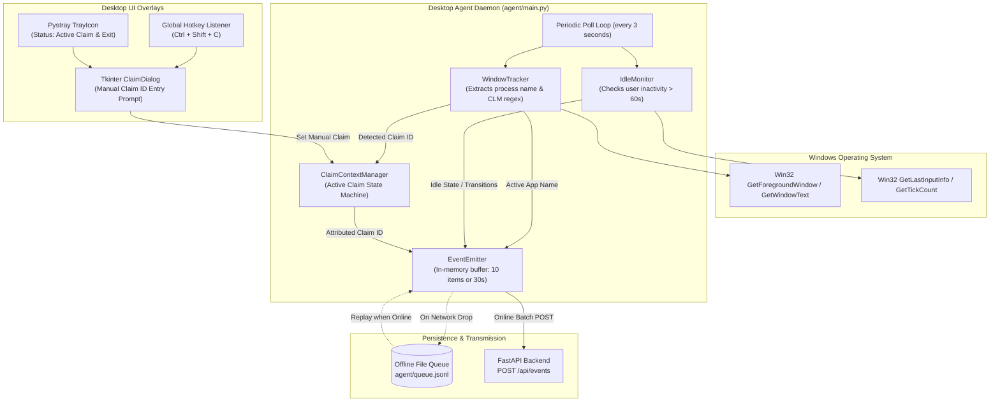

# Windows Desktop Agent (`agent/`)

> **Owner**: Member 1 (Client / Windows Desktop Engineer)  
> **Role**: Captures foreground window activity, monitors idle periods, maintains active claim context, and reliably streams telemetry batches to the backend.

---

## 🏛️ Module Architecture



---

## 📌 1. Implemented As of Now

| File | Purpose / Status |
| :--- | :--- |
| [`config.json`](file:///b:/Projects/TMS/agent/config.json) | Configures poll interval (`3s`), idle threshold (`60s`), batch size (`10`), flush interval (`30s`), and claim regex (`CLM\d{4,8}`). |
| [`tracker.py`](file:///b:/Projects/TMS/agent/tracker.py) | **WindowTracker**: Inspects active foreground window using `pygetwindow`, maps process names using `shared/app-map.json`, and extracts claim IDs matching regex `CLM\d+` from window titles. |
| [`idle_monitor.py`](file:///b:/Projects/TMS/agent/idle_monitor.py) | **IdleMonitor**: Uses native Windows `GetLastInputInfo` (zero-lag, no admin privileges required) to measure user input inactivity. Detects `IDLE_START` and `IDLE_END` transitions. |
| [`claim_context.py`](file:///b:/Projects/TMS/agent/claim_context.py) | **ClaimContextManager** *(Core Innovation)*: State machine that attributes all subsequent application visits (Excel, Chrome, Acrobat) to the currently active claim context until a new claim is detected or current claim closes. |
| [`dialog.py`](file:///b:/Projects/TMS/agent/dialog.py) | **ClaimDialog**: Non-blocking dark-themed Tkinter popup dialog prompting the associate to manually set or override the active claim ID with validation against `^CLM\d{4,8}$`. |
| [`emitter.py`](file:///b:/Projects/TMS/agent/emitter.py) | **EventEmitter**: Batches events into memory (10 events or 30s) and POSTs to `/api/events`. If backend is unreachable or offline, writes events to disk queue (`queue.jsonl`) and automatically replays upon reconnection. |
| [`tray.py`](file:///b:/Projects/TMS/agent/tray.py) | **TrayIcon**: System tray menu showing active claim status, associate ID, manual claim dialog trigger, and exit button. |
| [`mock_backend.py`](file:///b:/Projects/TMS/agent/mock_backend.py) | Lightweight standalone HTTP server using Python `http.server`. Allows Member 1 to test agent tracking completely offline without needing PostgreSQL or FastAPI running. |
| [`main.py`](file:///b:/Projects/TMS/agent/main.py) | Entry point orchestrating tracker, idle monitor, claim context, emitter, and signal handlers. |

### How to Run As of Now:
```bash
cd agent
pip install -r requirements.txt

# Terminal 1: Run isolated mock server
python mock_backend.py

# Terminal 2: Run desktop agent daemon
python main.py
```

---

## 🚀 2. What to Implement Further to Complete the Full MVP

1. **PyInstaller Standalone Executable (`agent/build.spec`)**:
   - Compile the agent into a single binary `TMS-Agent.exe` so associates can run it without installing Python or dependencies.
2. **Global Hotkey Trigger (`Ctrl + Shift + C`)**:
   - Hook a system-wide hotkey to open [`agent/dialog.py`](file:///b:/Projects/TMS/agent/dialog.py) from any window.
3. **Smart Inactivity / Untracked Window Warning**:
   - If an associate spends > 5 minutes in an untracked app without an active claim context, display a tray notification or dialog.
4. **Resilience & Queue Drain Testing**:
   - Verify that killing the network causes events to write to `queue.jsonl`, and restoring network drains the queue completely without loss.
5. **Resource Profiling**:
   - Verify agent uses **<1% CPU** and **<50 MB RAM** on Windows 10/11.

---

## 🛠️ 3. How to Implement Remaining Tasks

### Task 1: Standalone PyInstaller Compilation
Create `agent/build.spec` or run:
```bash
pip install pyinstaller
pyinstaller --noconsole --onefile --name "TMS-Agent" --add-data "config.json;." --add-data "../shared/app-map.json;shared" main.py
```
Output will be in `agent/dist/TMS-Agent.exe`.

### Task 2: Global Hotkey Integration in `agent/main.py`
Add hotkey listening using `pynput.keyboard`:
```python
from pynput import keyboard
from dialog import ClaimDialog

def open_manual_dialog():
    dialog = ClaimDialog(on_submit=lambda cid: agent.claim_context.set_manual_claim(cid))
    dialog.show(current_claim=agent.claim_context.get_current_claim_id())

hotkey_listener = keyboard.GlobalHotKeys({
    '<ctrl>+<shift>+c': open_manual_dialog
})
hotkey_listener.start()
```

### Task 3: Inactivity / Untracked Window Prompt
Inside the `while self.running:` loop in `agent/main.py`:
```python
if self.claim_context.get_current_claim_id() == "UNASSIGNED":
    self.unassigned_counter += self.config["poll_interval_sec"]
    if self.unassigned_counter >= 300: # 5 minutes without active claim
        print("[Agent Warning] 5 minutes in untracked window without active claim.")
        open_manual_dialog()
        self.unassigned_counter = 0
else:
    self.unassigned_counter = 0
```
