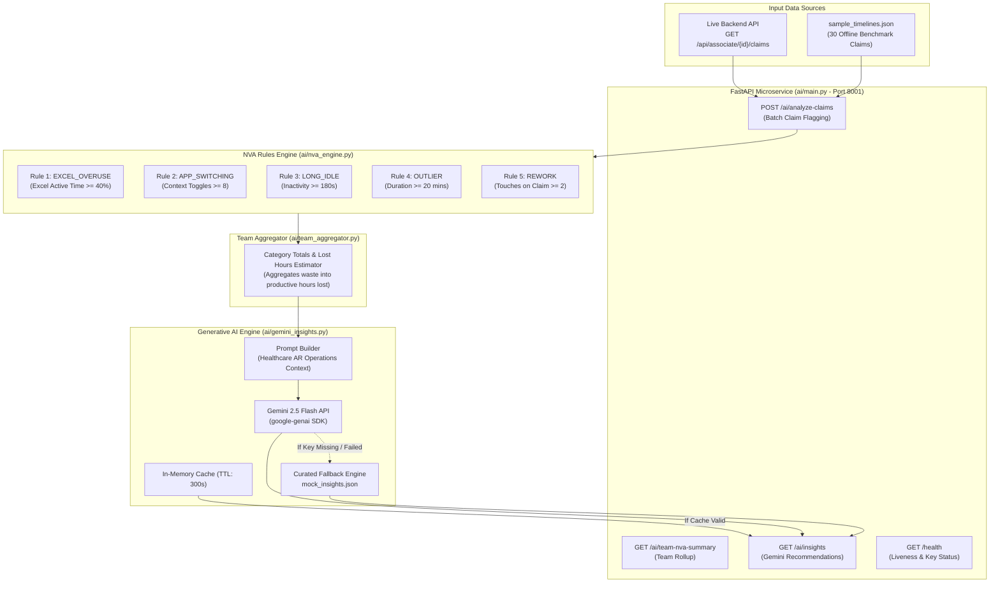

# AI Intelligence and Recommendations Engine (`ai/`)

**Non-Value-Added (NVA) Classification, Team Aggregations, and Generative AI Insights**  
*Lead Engineer: Member 3 (AI / ML & Intelligence Engineer)*

---

## 1. Module Overview and Responsibility

The AI microservice operates as a standalone service running on port 8001. It evaluates claim timelines against operational performance benchmarks to detect process waste (Non-Value-Added activity) and interfaces with **Google Gemini 2.5 Flash** to generate supervisor recommendations.

### Key Operational Goals
1. **Deterministic Rule Classification**: Fast, zero-hallucination heuristic checks (Excel overuse, rapid app switching, extended idle gaps, handling outliers, and rework touches).
2. **Team Bottleneck Aggregation**: Groups claim-level friction into team metrics and estimated lost productive hours.
3. **Structured Generative Intelligence**: Passes aggregated friction summaries to Gemini 2.5 Flash with structured output schemas for root-cause analysis and tactical supervisor coaching.

---

## 2. Module Architecture and Flow

### Intelligence Pipeline Architecture



---

## 3. The 5 Core Non-Value-Added (NVA) Rules

| Rule Name | Trigger Threshold | Operational Healthcare Root Cause |
| :--- | :--- | :--- |
| **`EXCEL_OVERUSE`** | Excel active time $\ge$ 40% of duration (min duration 180s) | Associate is manually cross-referencing fee schedules, modifier codes, or provider numbers in spreadsheets instead of using system lookups. |
| **`APP_SWITCHING`** | App toggles $\ge$ 8 switches per claim | Associate is repeatedly copy-pasting authorization numbers, patient demographics, or claim IDs between payer portals and billing tools. |
| **`LONG_IDLE`** | Inactive idle duration $\ge$ 180s (3 minutes) | System delay, waiting on payer phone queue, unlogged break, or document retrieval block. |
| **`OUTLIER`** | Total claim handling time $\ge$ 1200s (20 minutes) | Complex payer denial (e.g. CO-16 medical necessity dispute) lacking standard resolution protocol. |
| **`REWORK`** | Claim touches $\ge$ 2 touches in same shift | Claim was re-opened due to billing error, missing modifier, or initial rejection. |

---

## 4. Implemented Inventory

| File | Component / Class | Current Responsibility |
| :--- | :--- | :--- |
| [`nva_engine.py`](file:///b:/Projects/TMS/ai/nva_engine.py) | `NVAEngine` | Skeleton defining the 5 NVA rules with constants, threshold checks, and batch claim analysis. |
| [`team_aggregator.py`](file:///b:/Projects/TMS/ai/team_aggregator.py) | `TeamAggregator` | Aggregates analyzed claim lists into team-level friction metrics and calculates estimated lost hours. |
| [`gemini_insights.py`](file:///b:/Projects/TMS/ai/gemini_insights.py) | `GeminiInsightGenerator` | Interfaces with Google Gemini 2.5 Flash using `google-genai` SDK. Includes a 300-second TTL cache and automatic fallback to static cards. |
| [`sample_timelines.json`](file:///b:/Projects/TMS/ai/sample_timelines.json) | Test Dataset | 30 realistic claim timelines for tuning rules and testing without live backend dependencies. |
| [`mock_insights.json`](file:///b:/Projects/TMS/ai/mock_insights.json) | Static Insights | 3 high-fidelity fallback insight cards (Excel Bottleneck, Rapid Toggling, Long Outliers). |
| [`main.py`](file:///b:/Projects/TMS/ai/main.py) | Microservice Entrypoint | FastAPI application on port 8001 exposing `/ai/analyze-claims`, `/ai/team-nva-summary`, `/ai/insights`, and `/health`. |

---

## 5. What to Implement Further

1. **Live Backend Claim Ingestion**:
   - Update `ai/main.py` to call `GET http://localhost:8000/api/associate/{id}/claims` to analyze live database timelines.
2. **Runtime Gemini API Key Hot-Reload (`POST /ai/configure-key`)**:
   - Allow users or supervisors to submit a Gemini API key dynamically without restarting the server.
3. **Domain Prompt Tuning with Denial Codes**:
   - Add explicit guidelines for healthcare denial codes (CO-16, CO-45, PR-1) into prompt templates.
4. **Automated Unit Test Suite (`ai/tests/test_nva.py`)**:
   - Pytest tests covering boundary conditions for all 5 NVA rules.

---

## 6. How to Implement

### Step 1: Connecting to Live Backend API
In `ai/main.py`, replace static file loading with an asynchronous HTTP client:
```python
import httpx
import os

BACKEND_URL = os.getenv("BACKEND_URL", "http://localhost:8000")

async def fetch_live_claims() -> list:
    """Fetches live claims from the backend; falls back to sample file on network failure."""
    try:
        async with httpx.AsyncClient(timeout=4.0) as client:
            resp = await client.get(f"{BACKEND_URL}/api/associate/EMP101/claims")
            if resp.status_code == 200:
                return resp.json()
    except Exception as err:
        print(f"[AI Service] Could not reach backend: {err}. Using local benchmarks.")
    return load_sample_timelines()
```

### Step 2: Adding Dynamic API Key Hot-Reload
In `ai/main.py`, add the configuration endpoint:
```python
from pydantic import BaseModel

class KeyConfigPayload(BaseModel):
    api_key: str

@app.post("/ai/configure-key")
async def update_gemini_key(payload: KeyConfigPayload):
    gemini_generator.api_key = payload.api_key.strip()
    gemini_generator._cache = None  # Invalidate in-memory cache
    try:
        from google import genai
        client = genai.Client(api_key=gemini_generator.api_key)
        resp = client.models.generate_content(model="gemini-2.5-flash", contents="Test")
        return {"status": "success", "message": "Gemini API key verified successfully."}
    except Exception as err:
        return {"status": "error", "message": f"Verification failed: {str(err)}"}
```

### Step 3: Unit Testing Boundary Conditions (`ai/tests/test_nva.py`)
Create `ai/tests/test_nva.py`:
```python
from nva_engine import NVAEngine

def test_excel_overuse_boundary():
    engine = NVAEngine()
    # 39% Excel -> Not flagged
    c1 = {"total_duration_seconds": 200, "app_breakdown": {"Excel": 78}}
    assert "EXCEL_OVERUSE" not in engine.analyze_claim(c1)

    # 41% Excel -> Flagged
    c2 = {"total_duration_seconds": 200, "app_breakdown": {"Excel": 82}}
    assert "EXCEL_OVERUSE" in engine.analyze_claim(c2)

def test_app_switching_boundary():
    engine = NVAEngine()
    assert "APP_SWITCHING" not in engine.analyze_claim({"app_switches_count": 7})
    assert "APP_SWITCHING" in engine.analyze_claim({"app_switches_count": 8})
```
Execute with: `pytest ai/tests/`

---

## 7. How to Run and Test

```bash
cd ai
pip install -r requirements.txt

# Run service on port 8001
uvicorn main:app --reload --port 8001
```
- Health Check: `http://localhost:8001/health`
- Live AI Insights: `http://localhost:8001/ai/insights`
- Team NVA Summary: `http://localhost:8001/ai/team-nva-summary`
