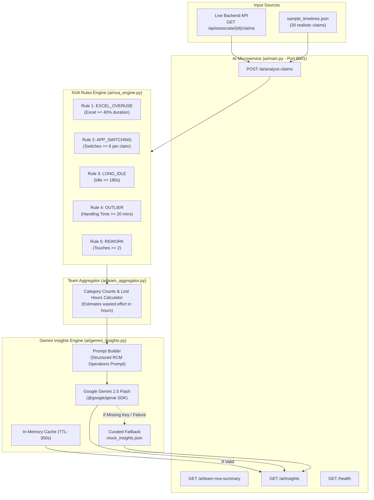

# AI Intelligence & Recommendations Microservice (`ai/`)

> **Owner**: Member 3 (AI / ML & Intelligence Engineer)  
> **Role**: Classifies Non-Value-Added (NVA) friction, aggregates team bottlenecks, and generates actionable operational recommendations using Google Gemini 2.5 Flash.

---

## 🏛️ Module Architecture



---

## 📌 1. Implemented As of Now

| File | Purpose / Status |
| :--- | :--- |
| [`nva_engine.py`](file:///b:/Projects/TMS/ai/nva_engine.py) | **NVAEngine**: Foundational skeleton implementing the **5 Core Operational Rules**:  <br>• `EXCEL_OVERUSE`: Excel active time ≥ 40% of duration (min 180s).<br>• `APP_SWITCHING`: App context switches ≥ 8.<br>• `LONG_IDLE`: Accumulated inactive idle time ≥ 180s.<br>• `OUTLIER`: Total handling time ≥ 1200s (20 mins).<br>• `REWORK`: Touches on same claim ≥ 2. |
| [`team_aggregator.py`](file:///b:/Projects/TMS/ai/team_aggregator.py) | **TeamAggregator**: Aggregates batch-analyzed claims into team summaries: category counts, top friction bottleneck, and total estimated lost hours. |
| [`gemini_insights.py`](file:///b:/Projects/TMS/ai/gemini_insights.py) | **GeminiInsightGenerator**: Formulates structured operations prompts for **Gemini 2.5 Flash** (`google-genai` SDK). Includes 300s TTL in-memory cache and automatic fallback to [`mock_insights.json`](file:///b:/Projects/TMS/ai/mock_insights.json) if the API key is not yet provided or network fails. |
| [`sample_timelines.json`](file:///b:/Projects/TMS/ai/sample_timelines.json) | 30 realistic test claims for tuning rules and prompts without needing a live backend. |
| [`mock_insights.json`](file:///b:/Projects/TMS/ai/mock_insights.json) | 3 curated fallback insight cards (Excel Bottleneck, Rapid Toggling, Long Handling Outliers). |
| [`main.py`](file:///b:/Projects/TMS/ai/main.py) | FastAPI microservice on port 8001 exposing `/ai/analyze-claims`, `/ai/team-nva-summary`, `/ai/insights`, and `/health`. |

### How to Run As of Now:
```bash
cd ai
pip install -r requirements.txt

# Run AI microservice (runs with rule-based fallback if no GEMINI_API_KEY is in .env)
uvicorn main:app --reload --port 8001
```
Test endpoints:
- `GET http://localhost:8001/ai/insights`
- `GET http://localhost:8001/ai/team-nva-summary`
- `GET http://localhost:8001/health`

---

## 🚀 2. What to Implement Further to Complete the Full MVP

1. **Live Backend Claim Ingestion**:
   - Update `ai/main.py` to fetch actual `ClaimTimeline` objects from `GET http://localhost:8000/api/associate/{id}/claims` rather than reading only from static `sample_timelines.json`.
2. **Runtime Gemini API Key Hot-Reload (`POST /ai/configure-key`)**:
   - Allow setting or updating the Gemini API key dynamically via API without needing to restart the microservice.
3. **Advanced Healthcare RCM Prompt Tuning**:
   - Incorporate specific denial codes from `PROBLEM STATEMENT.txt` into prompt guidelines:
     - **CO-16 Denials**: Claim lack of info / medical records.
     - **CO-45 Denials**: Charges exceed fee schedule allowance.
     - **PR-1 / PR-2**: Deductibles and coinsurance checks.
4. **Automated Unit Test Suite (`ai/tests/test_nva.py`)**:
   - Unit tests verifying exact boundary thresholds for all 5 NVA rules.

---

## 🛠️ 3. How to Implement Remaining Tasks

### Task 1: Fetching Live Claims from Backend API
In `ai/main.py`:
```python
import httpx
import os

BACKEND_URL = os.getenv("BACKEND_URL", "http://localhost:8000")

async def fetch_live_claims() -> list:
    try:
        async with httpx.AsyncClient(timeout=4.0) as client:
            resp = await client.get(f"{BACKEND_URL}/api/associate/EMP101/claims")
            if resp.status_code == 200:
                return resp.json()
    except Exception as e:
        print(f"[AI Service] Could not reach backend: {e}. Falling back to sample claims.")
    return load_sample_timelines()
```

### Task 2: Implementing Runtime API Key Endpoint (`/ai/configure-key`)
In `ai/main.py`:
```python
from pydantic import BaseModel

class KeyConfigIn(BaseModel):
    api_key: str

@app.post("/ai/configure-key")
async def configure_key(payload: KeyConfigIn):
    gemini_generator.api_key = payload.api_key.strip()
    gemini_generator._cache = None # Invalidate cache
    try:
        from google import genai
        client = genai.Client(api_key=gemini_generator.api_key)
        resp = client.models.generate_content(model="gemini-2.5-flash", contents="Test")
        return {"status": "success", "message": "Gemini API key verified and active!"}
    except Exception as e:
        return {"status": "error", "message": f"Invalid Gemini Key: {str(e)}"}
```

### Task 3: Unit Testing the 5 NVA Rules (`ai/tests/test_nva.py`)
Create `ai/tests/test_nva.py`:
```python
from nva_engine import NVAEngine

def test_excel_overuse_boundary():
    engine = NVAEngine()
    # 39% Excel -> Not flagged
    c1 = {"total_duration_seconds": 200, "app_breakdown": {"Excel": 78}}
    assert "EXCEL_OVERUSE" not in engine.analyze_claim(c1)
    
    # 41% Excel -> Flagged
    c2 = {"total_duration_seconds": 200, "app_breakdown": {"Excel": 82}}
    assert "EXCEL_OVERUSE" in engine.analyze_claim(c2)

def test_app_switching_threshold():
    engine = NVAEngine()
    assert "APP_SWITCHING" not in engine.analyze_claim({"app_switches_count": 7})
    assert "APP_SWITCHING" in engine.analyze_claim({"app_switches_count": 8})
```
Run with: `pytest ai/tests/`
