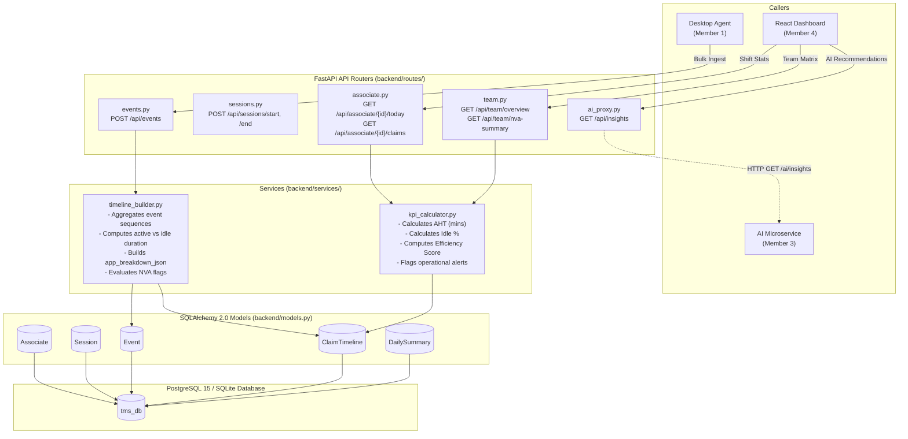

# TMS Backend API & Database (`backend/`)

> **Owner**: Member 2 (Backend & Database Engineer)  
> **Role**: High-throughput telemetry ingestion, relational persistence, claim timeline reconstruction, and analytics KPI calculations.

---

## 🏛️ Module Architecture



---

## 📌 1. Implemented As of Now

| File | Purpose / Status |
| :--- | :--- |
| [`database.py`](file:///b:/Projects/TMS/backend/database.py) | Async SQLAlchemy 2.0 setup with lazy engine initialization. Seamlessly switches between SQLite (`sqlite+aiosqlite`) for zero-dependency local dev and PostgreSQL (`postgresql+asyncpg`) for production. |
| [`models.py`](file:///b:/Projects/TMS/backend/models.py) | **5 Relational Models**: `Associate`, `Session`, `Event`, `ClaimTimeline`, `DailySummary` with proper foreign keys and composite indexes (`idx_events_claim_time`, `idx_timeline_claim_associate`). |
| [`schemas.py`](file:///b:/Projects/TMS/backend/schemas.py) | Pydantic request/response schemas: `BulkEventsIn`, `SessionStartIn`, `AssociateTodayOut`, `TeamOverviewOut`, `NVASummaryOut`, `InsightCard`. |
| [`services/timeline_builder.py`](file:///b:/Projects/TMS/backend/services/timeline_builder.py) | **Foundational Skeleton**: Groups events by claim, updates `ClaimTimeline` start/end timestamps, handles baseline duration calculation, and defines `evaluate_nva_flags()`. |
| [`services/kpi_calculator.py`](file:///b:/Projects/TMS/backend/services/kpi_calculator.py) | **Foundational Skeleton**: Computes AHT, Idle %, Active %, Efficiency score (`100 - (idle_percent * 0.7) - nva_penalty`), and aggregates application share breakdown. |
| [`routes/events.py`](file:///b:/Projects/TMS/backend/routes/events.py) | `POST /api/events` — High-throughput bulk event ingestion. Auto-provisions associate and session if not existing. |
| [`routes/sessions.py`](file:///b:/Projects/TMS/backend/routes/sessions.py) | `POST /api/sessions/start`, `POST /api/sessions/end` — Session lifecycle control. |
| [`routes/associate.py`](file:///b:/Projects/TMS/backend/routes/associate.py) | `GET /api/associate/{id}/today`, `/claims`, `/claims/{cid}/timeline` — Telemetry for associate workspace and single-claim audit trails. |
| [`routes/team.py`](file:///b:/Projects/TMS/backend/routes/team.py) | `GET /api/team/overview`, `GET /api/team/nva-summary` — Manager overview and team NVA distribution. |
| [`routes/ai_proxy.py`](file:///b:/Projects/TMS/backend/routes/ai_proxy.py) | `GET /api/insights` — Proxies to AI service (port 8001) with rule-based fallback if microservice is offline. |
| [`mock_responses/`](file:///b:/Projects/TMS/backend/mock_responses/) | **6 Day-0 Mock Files**: `associate_today.json`, `associate_claims.json`, `claim_timeline.json`, `team_overview.json`, `nva_summary.json`, `ai_insights.json`. |
| [`docker-compose.yml`](file:///b:/Projects/TMS/backend/docker-compose.yml) | Multi-container setup orchestrating PostgreSQL 15, Backend, and AI microservice. |
| [`main.py`](file:///b:/Projects/TMS/backend/main.py) | FastAPI application entry point with CORS middleware, lifespan auto table creation, and `/health` probe. |

### How to Run As of Now:
```bash
cd backend
pip install -r requirements.txt

# Run with SQLite (instant local dev)
uvicorn main:app --reload --port 8000

# Or run with Docker Compose (PostgreSQL)
docker-compose up -d
```
Interactive Swagger API documentation: `http://localhost:8000/docs`

---

## 🚀 2. What to Implement Further to Complete the Full MVP

1. **Alembic Database Migrations (`backend/alembic/`)**:
   - Initialize and configure versioned migrations instead of relying on `create_all()`.
2. **Realistic Historical Seeder (`backend/scripts/seed_db.py`)**:
   - Seed 4 associates (`EMP101`–`EMP104`) and 60 realistic historical claims matching data from `Project_Requirements/Prev Entd Voice T&M.xlsx`.
3. **Daily Summary Aggregation Background Job (`backend/services/daily_rollup.py`)**:
   - Nightly rollup job that reads completed `ClaimTimeline` entries for each associate and writes immutable summary records into `daily_summaries`.
4. **Session Watchdog (Auto-Timeout)**:
   - Detect and terminate stale sessions if no agent telemetry is received for > 15 minutes.
5. **Automated Integration Test Suite (`backend/tests/test_api.py`)**:
   - Pytest suite testing bulk ingestion, duration math, and KPI rollups.

---

## 🛠️ 3. How to Implement Remaining Tasks

### Task 1: Setting Up Alembic Migrations
```bash
cd backend
pip install alembic
alembic init alembic
```
In `alembic/env.py`, set:
```python
from models import Base
target_metadata = Base.metadata
```
Create and apply migration:
```bash
alembic revision --autogenerate -m "Initial schema"
alembic upgrade head
```

### Task 2: Writing `backend/scripts/seed_db.py`
Create `backend/scripts/seed_db.py`:
```python
import asyncio
from datetime import datetime, timedelta
import json
from database import get_session_maker, init_db
from models import Associate, Session, ClaimTimeline

async def seed():
    await init_db()
    session_maker = get_session_maker()
    async with session_maker() as db:
        associates = [
            Associate(id="EMP101", name="Priya Sharma", email="priya@company.com"),
            Associate(id="EMP102", name="Rahul Verma", email="rahul@company.com"),
            Associate(id="EMP103", name="Ananya Iyer", email="ananya@company.com"),
            Associate(id="EMP104", name="Karthik Raja", email="karthik@company.com"),
        ]
        for a in associates:
            db.add(a)
        await db.commit()

        base_time = datetime.utcnow() - timedelta(hours=6)
        claims = [
            ("CLM1025", 600, 580, 20, 5, {"ClaimPlatform": 350, "Chrome": 230}, []),
            ("CLM1026", 900, 750, 150, 12, {"ClaimPlatform": 310, "Excel": 390}, ["EXCEL_OVERUSE", "APP_SWITCHING"]),
            ("CLM1027", 430, 410, 20, 4, {"ClaimPlatform": 260, "Chrome": 150}, []),
        ]
        for cid, tot, act, idle, sw, bdown, flags in claims:
            tl = ClaimTimeline(
                claim_id=cid,
                associate_id="EMP101",
                session_id="sess-seed-001",
                start_time=base_time,
                end_time=base_time + timedelta(seconds=tot),
                total_duration_seconds=tot,
                active_duration_seconds=act,
                idle_duration_seconds=idle,
                app_switches_count=sw,
                app_breakdown_json=json.dumps(bdown),
                status="COMPLETED",
                nva_flags_json=json.dumps(flags)
            )
            db.add(tl)
            base_time += timedelta(seconds=tot + 60)
        await db.commit()
        print("Database seeded successfully with historical claims!")

if __name__ == "__main__":
    asyncio.run(seed())
```

### Task 3: Implementing Daily Rollup Service (`daily_rollup.py`)
```python
from datetime import date
from sqlalchemy import select, func
from models import ClaimTimeline, DailySummary

async def run_daily_rollup(db, target_date: str):
    # Query all completed timelines
    stmt = select(ClaimTimeline).where(ClaimTimeline.status == "COMPLETED")
    res = await db.execute(stmt)
    timelines = res.scalars().all()
    
    # Compute totals
    total_claims = len(timelines)
    total_work = sum(t.total_duration_seconds for t in timelines)
    total_active = sum(t.active_duration_seconds for t in timelines)
    total_idle = sum(t.idle_duration_seconds for t in timelines)
    aht = round((total_work / total_claims) / 60.0, 1) if total_claims else 0.0
    
    summary = DailySummary(
        associate_id="EMP101",
        date=target_date,
        total_claims_completed=total_claims,
        total_work_seconds=total_work,
        total_active_seconds=total_active,
        total_idle_seconds=total_idle,
        aht_seconds=aht * 60.0,
        efficiency_score=85.0
    )
    db.add(summary)
    await db.commit()
```
