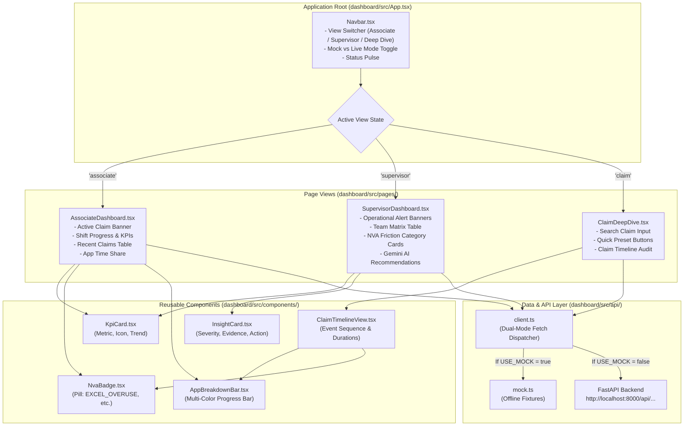

# TMS Frontend SaaS Dashboard (`dashboard/`)

> **Owner**: Member 4 (Frontend / UI & UX Engineer)  
> **Role**: Ultra-modern, responsive SaaS interface providing real-time operational visibility for Associates and Supervisors.

---

## 🏛️ Module Architecture



---

## 📌 1. Implemented As of Now

| File / Component | Purpose / Status |
| :--- | :--- |
| [`index.css`](file:///b:/Projects/TMS/dashboard/src/index.css) | Custom modern dark SaaS design system (deep slate `#080c16`, glassmorphic cards, radiant border glows, Plus Jakarta Sans typography, and JetBrains Mono). |
| [`config.ts`](file:///b:/Projects/TMS/dashboard/src/config.ts) | Environment settings, `USE_MOCK` boolean flag, `API_BASE` endpoint, application color palette, and NVA flag tags. |
| [`api/types.ts`](file:///b:/Projects/TMS/dashboard/src/api/types.ts) | Full TypeScript definitions for `AppBreakdown`, `ClaimTimelineItem`, `AssociateTodayData`, `TeamOverviewData`, `NVASummaryData`, and `InsightCard`. |
| [`api/mock.ts`](file:///b:/Projects/TMS/dashboard/src/api/mock.ts) | Complete offline mock fixtures for instant out-of-the-box development and demonstration. |
| [`api/client.ts`](file:///b:/Projects/TMS/dashboard/src/api/client.ts) | Dual-mode API client. Seamlessly switches between local mock fixtures and live FastAPI backend (`http://localhost:8000/api/...`). |
| [`components/Navbar.tsx`](file:///b:/Projects/TMS/dashboard/src/components/Navbar.tsx) | Sticky navigation bar featuring live shift status pulse, interactive view switcher, and **Mock / Live Backend** toggle switch. |
| [`components/KpiCard.tsx`](file:///b:/Projects/TMS/dashboard/src/components/KpiCard.tsx) | Metric cards with top accent glowing lines, subtitle labels, icons, and trend indicators. |
| [`components/NvaBadge.tsx`](file:///b:/Projects/TMS/dashboard/src/components/NvaBadge.tsx) | Color-coded badges for `EXCEL_OVERUSE`, `APP_SWITCHING`, `LONG_IDLE`, `OUTLIER`, and `REWORK`. |
| [`components/AppBreakdownBar.tsx`](file:///b:/Projects/TMS/dashboard/src/components/AppBreakdownBar.tsx) | Multi-color stacked horizontal progress bar showing application time distribution. |
| [`components/InsightCard.tsx`](file:///b:/Projects/TMS/dashboard/src/components/InsightCard.tsx) | AI recommendation card showing severity pill, impacted claims count, estimated lost time, tactical recommendation box, and evidence bullets. |
| [`components/ClaimTimelineView.tsx`](file:///b:/Projects/TMS/dashboard/src/components/ClaimTimelineView.tsx) | Interactive visual timeline showing claim durations, app breakdown, and chronological event sequence. |
| [`pages/AssociateDashboard.tsx`](file:///b:/Projects/TMS/dashboard/src/pages/AssociateDashboard.tsx) | Associate Workspace featuring **Active Claim Context Banner**, today's 4 KPIs, recent claims table, and application share breakdown. |
| [`pages/SupervisorDashboard.tsx`](file:///b:/Projects/TMS/dashboard/src/pages/SupervisorDashboard.tsx) | Operations overview with team KPIs, operational alerts, associate status table (Active/Idle/Offline), NVA friction cards, and Gemini AI feed. |
| [`pages/ClaimDeepDive.tsx`](file:///b:/Projects/TMS/dashboard/src/pages/ClaimDeepDive.tsx) | Investigation drill-down for searching any Claim ID, with quick preset buttons and full telemetry event audit log. |

### How to Run As of Now:
```bash
cd dashboard
npm install
npm run dev
```
Open browser at: `http://localhost:5173`
- Click the **Mock Fixtures / Live Backend** pill in the top-right navbar to toggle between offline fixtures and the live FastAPI backend!
- Click between **Associate Workspace**, **Supervisor Overview**, and **Claim Deep Dive**.

---

## 🚀 2. What to Implement Further to Complete the Full MVP

1. **Auto-Refresh Polling Hook (`useLivePolling.ts`)**:
   - Automatically fetch fresh data every 15–30 seconds when in Live Backend mode so the dashboard updates in real time as the agent streams events.
2. **Table Search, Filter & Sorting**:
   - **Associate View**: Filter claims by NVA flag (e.g., show only *"Excel Overuse"*), search by Claim ID, sort by duration.
   - **Supervisor View**: Sort associates by Efficiency Score or AHT.
3. **Supervisor-to-Associate Drill-Down**:
   - In Supervisor view, clicking on an associate row should immediately navigate to that specific associate's personalized dashboard view.
4. **Export Report Button (CSV / JSON)**:
   - Add a *"Download Shift Summary"* button to export current claims and metrics to a CSV file.
5. **Toast Notifications**:
   - Display non-intrusive toast messages when the backend connects/disconnects or when a claim is inspected.

---

## 🛠️ 3. How to Implement Remaining Tasks

### Task 1: Implementing `useLivePolling.ts`
Create `dashboard/src/hooks/useLivePolling.ts`:
```typescript
import { useEffect, useRef } from 'react'
import { CONFIG } from '../config'

export function useLivePolling(callback: () => void, intervalMs: number = CONFIG.POLL_INTERVAL_MS) {
  const savedCallback = useRef(callback)

  useEffect(() => {
    savedCallback.current = callback
  }, [callback])

  useEffect(() => {
    if (CONFIG.USE_MOCK) return // Don't poll in mock mode

    const id = setInterval(() => savedCallback.current(), intervalMs)
    return () => clearInterval(id)
  }, [intervalMs])
}
```
Usage in `AssociateDashboard.tsx`:
```typescript
useLivePolling(loadData, 15000)
```

### Task 2: Adding Filter Pills to Recent Claims Table
In `AssociateDashboard.tsx`:
```typescript
const [filterFlag, setFilterFlag] = useState<string>('ALL')

const filteredClaims = data.recent_claims.filter(c => {
  if (filterFlag === 'ALL') return true
  return c.nva_flags.includes(filterFlag)
})
```
Add filter buttons above the table:
```tsx
<div style={{ display: 'flex', gap: 8, marginBottom: 12 }}>
  {['ALL', 'EXCEL_OVERUSE', 'APP_SWITCHING', 'LONG_IDLE', 'OUTLIER'].map(flag => (
    <button
      key={flag}
      onClick={() => setFilterFlag(flag)}
      className={`btn-ghost ${filterFlag === flag ? 'active' : ''}`}
      style={{ padding: '4px 10px', fontSize: '0.75rem' }}
    >
      {flag === 'ALL' ? 'All Claims' : flag}
    </button>
  ))}
</div>
```

### Task 3: Supervisor Associate Click Drill-Down
In `App.tsx`, pass an `activeAssociateId` state and handler:
```typescript
const [activeAssociateId, setActiveAssociateId] = useState('EMP101')

const handleSelectAssociate = (assocId: string) => {
  setActiveAssociateId(assocId)
  setCurrentView('associate')
}
```
Pass `onSelectAssociate={handleSelectAssociate}` to `<SupervisorDashboard />`, and attach `onClick={() => onSelectAssociate(a.associate_id)}` to the table rows.
