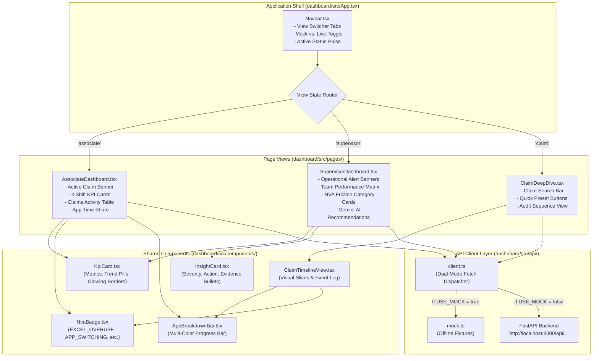

# Frontend SaaS Dashboard (`dashboard/`)

**Operational Command Center and Associate Workspace**  
*Lead Engineer: Member 4 (Frontend / UI & UX Engineer)*

---

## 1. Module Overview and Responsibility

The TMS Dashboard is built with **React 18**, **TypeScript**, and **Vite**. It provides a single-pane-of-glass interface tailored for two distinct personas:
1. **The Associate**: Sees their active claim context in real time, tracks their completed claim count vs. shift target, monitors their AHT and idle percentage, and sees their application distribution.
2. **The Operations Supervisor**: Monitors team throughput, identifies associates in prolonged idle states or high-NVA loops, analyzes team-wide friction distributions, and reviews Google Gemini operational recommendations.

---

## 2. Module Architecture and Flow

### React Component Hierarchy and Data Flow



---

## 3. Implemented Inventory

| File / Component | Type | Current Responsibility |
| :--- | :--- | :--- |
| [`index.css`](file:///b:/Projects/TMS/dashboard/src/index.css) | Design System | Custom dark SaaS stylesheet: slate background (`#080c16`), glassmorphic panels, CSS variables, Plus Jakarta Sans, and JetBrains Mono typography. |
| [`config.ts`](file:///b:/Projects/TMS/dashboard/src/config.ts) | Configuration | Environment constants, `USE_MOCK` boolean flag, `API_BASE` endpoint, and canonical application color palettes. |
| [`api/types.ts`](file:///b:/Projects/TMS/dashboard/src/api/types.ts) | Type Contracts | TypeScript interfaces for all backend models (`AssociateTodayData`, `TeamOverviewData`, `ClaimTimelineDetail`, `InsightCard`). |
| [`api/mock.ts`](file:///b:/Projects/TMS/dashboard/src/api/mock.ts) | Mock Fixtures | Static data fixtures allowing Member 4 to develop UI components without requiring backend services to run. |
| [`api/client.ts`](file:///b:/Projects/TMS/dashboard/src/api/client.ts) | API Client | Dispatches calls to either `mock.ts` or `http://localhost:8000/api/...` based on the active mode toggle. |
| [`components/Navbar.tsx`](file:///b:/Projects/TMS/dashboard/src/components/Navbar.tsx) | Navigation Header | Sticky top bar with brand mark, view switcher tabs, shift active status indicator, and Mock/Live backend switch. |
| [`components/KpiCard.tsx`](file:///b:/Projects/TMS/dashboard/src/components/KpiCard.tsx) | Metric Display | Card featuring top accent radiant glow lines, title, large value, icon, and trend comparison badge. |
| [`components/NvaBadge.tsx`](file:///b:/Projects/TMS/dashboard/src/components/NvaBadge.tsx) | Status Pill | Tag badges for `EXCEL_OVERUSE`, `APP_SWITCHING`, `LONG_IDLE`, `OUTLIER`, and `REWORK`. |
| [`components/AppBreakdownBar.tsx`](file:///b:/Projects/TMS/dashboard/src/components/AppBreakdownBar.tsx) | Visualization | Multi-color stacked horizontal bar showing application time allocation across a claim or shift. |
| [`components/InsightCard.tsx`](file:///b:/Projects/TMS/dashboard/src/components/InsightCard.tsx) | Recommendation Card | Displays Gemini findings: severity level, impacted claims count, estimated lost time, tactical recommendation box, and evidence bullets. |
| [`components/ClaimTimelineView.tsx`](file:///b:/Projects/TMS/dashboard/src/components/ClaimTimelineView.tsx) | Audit Trail | Visual breakdown of an individual claim's duration, app share, and chronological event sequence. |
| [`pages/AssociateDashboard.tsx`](file:///b:/Projects/TMS/dashboard/src/pages/AssociateDashboard.tsx) | Associate Workspace | Displays **Active Claim Context Banner**, 4 core shift KPIs, recent claims log table, and application share breakdown. |
| [`pages/SupervisorDashboard.tsx`](file:///b:/Projects/TMS/dashboard/src/pages/SupervisorDashboard.tsx) | Operations Hub | Displays team throughput KPIs, operational alert banners, associate performance matrix, NVA friction cards, and Gemini feed. |
| [`pages/ClaimDeepDive.tsx`](file:///b:/Projects/TMS/dashboard/src/pages/ClaimDeepDive.tsx) | Investigation View | Search claim by ID with quick preset buttons (`CLM1026`, `CLM1024`) and full telemetry event audit stream. |

---

## 4. What to Implement Further

1. **Auto-Refresh Polling Hook (`dashboard/src/hooks/useLivePolling.ts`)**:
   - Silently fetch updated data every 15–30 seconds in Live Backend mode so the dashboard updates in real time without screen flicker.
2. **Table Search, Filter & Sorting**:
   - **Associate View**: Filter recent claims by NVA flag (e.g., show only *"Excel Overuse"*), search by Claim ID, sort by duration.
   - **Supervisor View**: Sort associates by Efficiency Score, completed claims, or AHT.
3. **Supervisor-to-Associate Drill-Down Navigation**:
   - Clicking an associate row in the Supervisor matrix should navigate directly to that associate's personalized dashboard view.
4. **Export Utilities**:
   - Add a *"Download Shift Summary (CSV / JSON)"* button and a *"Copy Claim ID"* button.
5. **Toast Notifications**:
   - Display a non-intrusive toast notification when switching between Mock and Live backend mode, or when network status changes.

---

## 5. How to Implement

### Step 1: Creating `useLivePolling.ts`
Create `dashboard/src/hooks/useLivePolling.ts`:
```typescript
import { useEffect, useRef } from 'react'
import { CONFIG } from '../config'

export function useLivePolling(callback: () => void, intervalMs: number = CONFIG.POLL_INTERVAL_MS) {
  const savedCallback = useRef(callback)

  useEffect(() => {
    savedCallback.current = callback
  }, [callback])

  useEffect(() => {
    if (CONFIG.USE_MOCK) return // Skip polling in mock mode

    const intervalId = setInterval(() => savedCallback.current(), intervalMs)
    return () => clearInterval(intervalId)
  }, [intervalMs])
}
```
Usage in `AssociateDashboard.tsx`:
```typescript
useLivePolling(loadData, 15000)
```

### Step 2: Adding Filter Pills to Recent Claims Table
In `AssociateDashboard.tsx`:
```typescript
const [filterFlag, setFilterFlag] = useState<string>('ALL')

const filteredClaims = data.recent_claims.filter(claim => {
  if (filterFlag === 'ALL') return true
  return claim.nva_flags.includes(filterFlag)
})
```
Render the filter selector above the table:
```tsx
<div style={{ display: 'flex', gap: 8, marginBottom: 12 }}>
  {['ALL', 'EXCEL_OVERUSE', 'APP_SWITCHING', 'LONG_IDLE', 'OUTLIER'].map(flag => (
    <button
      key={flag}
      onClick={() => setFilterFlag(flag)}
      className={`btn-ghost ${filterFlag === flag ? 'active' : ''}`}
      style={{ padding: '4px 10px', fontSize: '0.75rem' }}
    >
      {flag === 'ALL' ? 'All Claims' : flag}
    </button>
  ))}
</div>
```

### Step 3: Supervisor-to-Associate Drill-Down
In `App.tsx`, maintain the selected associate ID:
```typescript
const [selectedAssociateId, setSelectedAssociateId] = useState('EMP101')

const handleSelectAssociate = (assocId: string) => {
  setSelectedAssociateId(assocId)
  setCurrentView('associate')
}
```
Pass `onSelectAssociate={handleSelectAssociate}` to `<SupervisorDashboard />`, and attach `onClick={() => onSelectAssociate(assoc.associate_id)}` to table rows.

---

## 6. How to Run and Test

```bash
cd dashboard
npm install
npm run dev
```
- Open your browser at: `http://localhost:5173`
- Click the **Mock Fixtures / Live Backend** button in the navbar to toggle between offline test fixtures and the live FastAPI backend.
- Validate build:
```bash
npm run build
```
*(Verified: builds cleanly with zero errors).*
