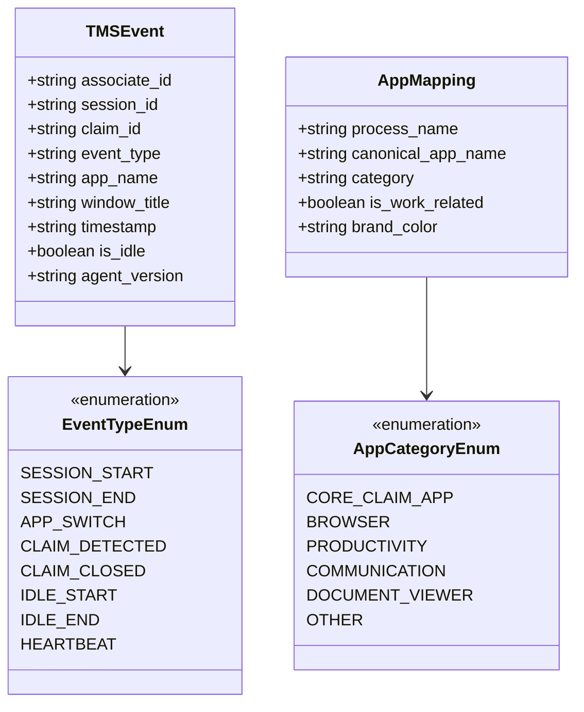

# Shared Contracts & Data Standards (`shared/`)

> **Target Audience**: All 4 Team Members  
> **Role**: Single Source of Truth (SSOT) defining JSON data schemas and OS process mappings that bind the Agent, Backend, AI Engine, and Frontend together.

---

## 🏛️ Module Architecture



---

## 📌 1. Implemented As of Now

### 1. `event-schema.json`
- **Location**: [`shared/event-schema.json`](file:///b:/Projects/TMS/shared/event-schema.json)
- **Status**: Complete Draft-07 JSON Schema.
- **Enforces**:
  - `associate_id`: string (e.g. `"EMP101"`).
  - `session_id`: string (e.g. `"sess-alpha-001"`).
  - `claim_id`: string (pattern `^(CLM[0-9]+|UNASSIGNED|IDLE_UNKNOWN)?$`).
  - `event_type`: strict enum (`APP_SWITCH`, `CLAIM_DETECTED`, `CLAIM_CLOSED`, `IDLE_START`, `IDLE_END`, `SESSION_START`, `SESSION_END`, `HEARTBEAT`).
  - `app_name`: canonical application name.
  - `timestamp`: ISO 8601 UTC date-time string.
  - `is_idle`: boolean.
  - `agent_version`: string (`"1.0.0"`).

### 2. `app-map.json`
- **Location**: [`shared/app-map.json`](file:///b:/Projects/TMS/shared/app-map.json)
- **Status**: Maps executable files to standardized names:
  - `excel.exe` → `"Excel"` (`PRODUCTIVITY`)
  - `chrome.exe` / `msedge.exe` / `firefox.exe` → `"Chrome"` / `"Edge"` (`BROWSER`)
  - `claimplatform.exe` → `"ClaimPlatform"` (`CORE_CLAIM_APP`)
  - `billingportal.exe` → `"BillingPortal"` (`CORE_CLAIM_APP`)
  - `acrord32.exe` / `acrobat.exe` → `"Adobe Acrobat"` (`DOCUMENT_VIEWER`)
  - Default fallback for unrecognized apps → `"Other Application"` (`OTHER`)
- Configures default claim regex: `CLM\d{4,8}`.

---

## 🚀 2. What to Implement Further to Complete the Full MVP

1. **Client Platform Mapping Expansion**:
   - Add hospital EHR and billing platforms:
     - `epic.exe` → `"Epic Hyperspace"` (`CORE_CLAIM_APP`, `#c026d3`)
     - `powerchart.exe` → `"Cerner PowerChart"` (`CORE_CLAIM_APP`, `#0284c7`)
     - `meditech.exe` → `"MEDITECH Expanse"` (`CORE_CLAIM_APP`, `#059669`)
2. **Support Multiple Claim Formats**:
   - Add support for CMS-1500 formats (`CLM-[0-9]{6}`), Medicare ICNs (`[0-9]{13}`), and payer authorization numbers.
3. **Automated Schema Validator Script (`validate_schema.py`)**:
   - Provide a shared Python script that any member can run to validate JSON payload test files against `event-schema.json`.

---

## 🛠️ 3. How to Implement

### Step 1: Adding New Systems in `shared/app-map.json`
Open [`shared/app-map.json`](file:///b:/Projects/TMS/shared/app-map.json) and add the entry:
```json
{
  "mappings": {
    "epic.exe": {
      "app_name": "Epic Hyperspace",
      "category": "CORE_CLAIM_APP",
      "is_work_related": true,
      "color": "#c026d3"
    }
  }
}
```

### Step 2: Implementing `validate_schema.py`
Create `shared/validate_schema.py`:
```python
import json
import jsonschema

with open("shared/event-schema.json", "r", encoding="utf-8") as f:
    SCHEMA = json.load(f)

def validate_event(event_dict: dict) -> bool:
    try:
        jsonschema.validate(instance=event_dict, schema=SCHEMA)
        return True
    except jsonschema.ValidationError as err:
        print(f"[Schema Violation] {err.message}")
        return False

if __name__ == "__main__":
    sample = {
        "associate_id": "EMP101",
        "session_id": "sess-001",
        "claim_id": "CLM1003",
        "event_type": "APP_SWITCH",
        "app_name": "Excel",
        "timestamp": "2026-10-06T12:00:00Z",
        "is_idle": False,
        "agent_version": "1.0.0"
    }
    assert validate_event(sample) is True
    print("Sample event validated successfully against schema!")
```
