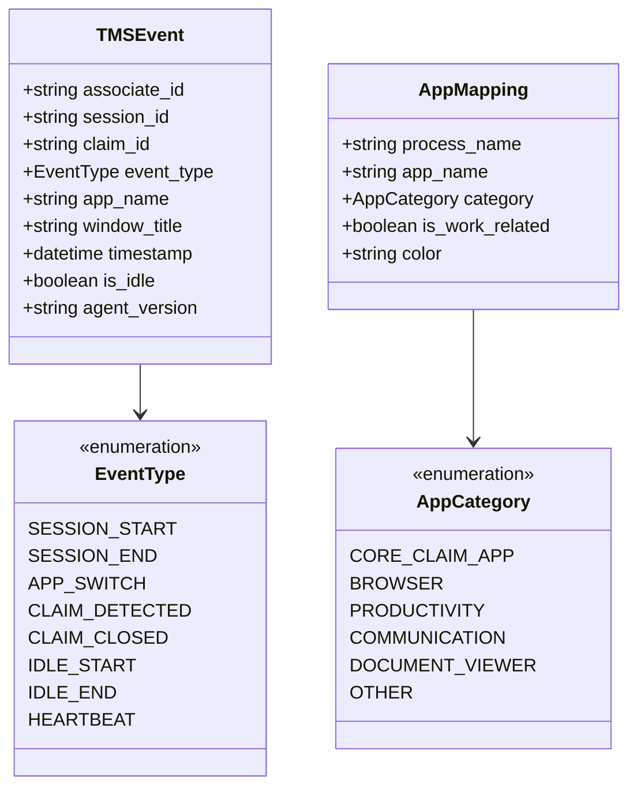
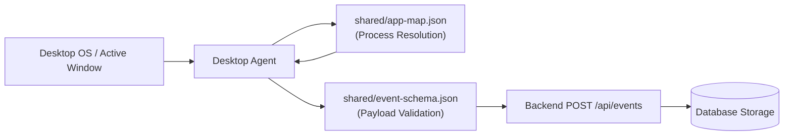

# Shared Contracts and Data Standards (`shared/`)

**Central Data Schemas, Process Mappings, and Validation Standards**  
*Single Source of Truth (SSOT) binding Agent, Backend, AI Engine, and Frontend*

---

## 1. Module Overview and Responsibility

The `shared/` directory establishes strict data standards between all four subsystems:
- **Member 1 (Agent)**: Emits telemetry events strictly adhering to `event-schema.json`.
- **Member 2 (Backend)**: Ingests, validates, and persists events using these schemas.
- **Member 3 (AI Engine)**: Reads claim timeline structures aligned with event categories.
- **Member 4 (Frontend)**: Uses TypeScript models mirroring these exact contracts.

---

## 2. Shared Data Architecture

### Data Models and Entity Relationships



### Event Validation and Ingestion Flow



---

## 3. Implemented Inventory

### 1. `event-schema.json`
- **Path**: [`shared/event-schema.json`](file:///b:/Projects/TMS/shared/event-schema.json)
- **Standard**: Draft-07 JSON Schema.
- **Contract Fields**:
  - `associate_id` (`string`, required): Employee ID (e.g., `"EMP101"`).
  - `session_id` (`string`, required): Work shift UUID (e.g., `"sess-alpha-001"`).
  - `claim_id` (`string`, required): Active claim identifier matching regex `^(CLM[0-9]+|UNASSIGNED|IDLE_UNKNOWN)?$`.
  - `event_type` (`string`, required): One of `APP_SWITCH`, `CLAIM_DETECTED`, `CLAIM_CLOSED`, `IDLE_START`, `IDLE_END`, `SESSION_START`, `SESSION_END`, `HEARTBEAT`.
  - `app_name` (`string`, required): Canonical application name.
  - `window_title` (`string`): Sanitized foreground window title.
  - `timestamp` (`string` date-time, required): UTC ISO-8601 timestamp.
  - `is_idle` (`boolean`, required): System inactivity indicator.
  - `agent_version` (`string`, required): Agent build version (`"1.0.0"`).

### 2. `app-map.json`
- **Path**: [`shared/app-map.json`](file:///b:/Projects/TMS/shared/app-map.json)
- **Standard**: JSON mapping table for executable names to human-readable labels:
  - `excel.exe` -> `"Excel"` (`PRODUCTIVITY`, `#107c41`)
  - `chrome.exe` -> `"Chrome"` (`BROWSER`, `#4285f4`)
  - `msedge.exe` -> `"Edge"` (`BROWSER`, `#0078d7`)
  - `claimplatform.exe` -> `"ClaimPlatform"` (`CORE_CLAIM_APP`, `#8b5cf6`)
  - `billingportal.exe` -> `"BillingPortal"` (`CORE_CLAIM_APP`, `#6366f1`)
  - `acrord32.exe` / `acrobat.exe` -> `"Adobe Acrobat"` (`DOCUMENT_VIEWER`, `#dc3545`)
  - Default unrecognized fallback -> `"Other Application"` (`OTHER`, `#94a3b8`)
- **Default Claim Regex**: `"CLM\\d{4,8}"`.

---

## 4. What to Implement Further

1. **Hospital EHR Process Additions**:
   - Add mappings for actual hospital systems: Epic (`epic.exe`), Cerner (`powerchart.exe`), and MEDITECH (`meditech.exe`).
2. **Alternate Claim Identifiers**:
   - Extend regex pattern to support CMS-1500 account numbers (`CLM-[0-9]{6}`) and Medicare ICNs (`[0-9]{13}`).
3. **Automated Schema Validator Utility (`shared/validate_schema.py`)**:
   - Create a reusable validation function that agent and backend test suites can call directly.

---

## 5. How to Implement

### Step 1: Extending `shared/app-map.json`
Add the new client application definitions inside the `mappings` block:
```json
{
  "mappings": {
    "epic.exe": {
      "app_name": "Epic Hyperspace",
      "category": "CORE_CLAIM_APP",
      "is_work_related": true,
      "color": "#c026d3"
    },
    "powerchart.exe": {
      "app_name": "Cerner PowerChart",
      "category": "CORE_CLAIM_APP",
      "is_work_related": true,
      "color": "#0284c7"
    }
  }
}
```

### Step 2: Creating `shared/validate_schema.py`
Create the standalone validator script:
```python
import json
import jsonschema

with open("shared/event-schema.json", "r", encoding="utf-8") as schema_file:
    EVENT_SCHEMA = json.load(schema_file)

def validate_event_payload(payload: dict) -> bool:
    """Validates an event payload against shared/event-schema.json."""
    try:
        jsonschema.validate(instance=payload, schema=EVENT_SCHEMA)
        return True
    except jsonschema.ValidationError as err:
        print(f"[Schema Violation] {err.message}")
        return False

if __name__ == "__main__":
    sample_event = {
        "associate_id": "EMP101",
        "session_id": "sess-alpha-001",
        "claim_id": "CLM1003",
        "event_type": "APP_SWITCH",
        "app_name": "Excel",
        "window_title": "Fee_Schedule_2026.xlsx - Excel",
        "timestamp": "2026-10-06T12:00:00Z",
        "is_idle": False,
        "agent_version": "1.0.0"
    }
    assert validate_event_payload(sample_event) is True
    print("Event schema validation passed successfully.")
```
